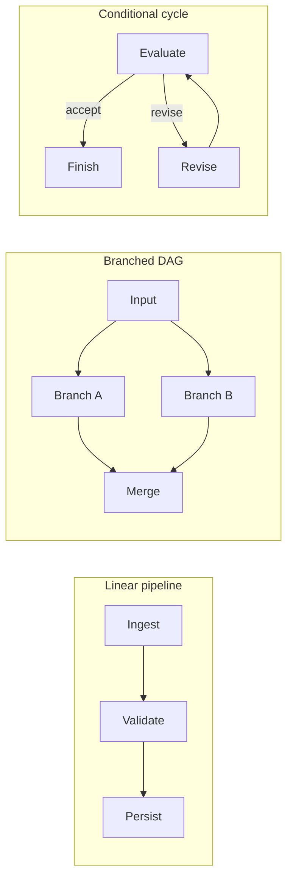
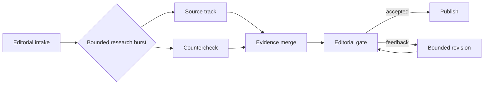

Teams often treat a graph-shaped agent workflow as a maturity upgrade. That reverses the decision. A pipeline is already a graph: one directed path through a set of tasks. I think the mature choice is the minimum topology that expresses the work and its failure behavior accurately.

A directed acyclic graph (DAG) can branch and merge but has no route back to an earlier task. A conditional graph chooses its next edge from runtime state, while a cyclic graph may revisit a task. A hybrid keeps a linear control path and uses those shapes only where they are needed. They are different topologies in the same design space, not levels of sophistication.

The right drawing begins with dependencies. Extra arrows do not create better judgment, reliability, or redundancy; those outcomes require explicit validation, retries, alternate paths, and operational controls.

In short
A pipeline, DAG, cycle, and hybrid are topology choices. Select the smallest one that describes the workflow truthfully.

## Find the fake edges

Every arrow should answer one question: what forces B to wait for A? A data dependency exists when B consumes A's result. A resource dependency exists when both jobs can change the same mutable resource, meaning a shared file, database row, workspace, or approval state. [PostgreSQL, an open-source object-relational database](https://www.postgresql.org/docs/current/transaction-iso.html), documents how one updater may wait for another touching the same row.

Capacity needs separate treatment. [Stripe, a payments platform](https://docs.stripe.com/rate-limits), documents request-rate and simultaneous-request limits separately. A shared limit couples two branches operationally, but it does not always impose a correctness order; a queue or lower concurrency may solve the problem without inventing an A-to-B dependency.

I think agent count is a distraction here. Apply the fake-edge test: if B does not consume A's output, both can read the same immutable input, neither changes shared state, and capacity controls permit overlap, the edge may be artificial. Keep the path linear when sequence is real, as in ingest request → validate schema → apply policy → persist result. Keep schema validation, counting, deduplication, and routing predicates in ordinary code; use models where judgment is required. Starting linear is a default, not dogma: obvious independent work may justify a DAG from the start.

In short
Remove an edge only after checking data flow, shared writes, and capacity. Real sequence deserves a pipeline.

## Make branches pay their coordination bill

Fan-out/fan-in means starting independent jobs and later merging their results. Concurrent scheduling does not shorten the critical path of a fixed DAG, which is its longest chain of dependent work. Removing a fake serial edge creates a different graph that may finish sooner. Yet a merge requiring every result still waits for its slowest required branch and adds merge work. [AWS Step Functions, Amazon's managed workflow service](https://docs.aws.amazon.com/step-functions/latest/dg/state-parallel.html), specifies that its Parallel state waits for every branch to terminate.

I think the merge, more than the fan-out, is the production decision.

| The merge must know | Minimum decision |
|---|---|
| Expected work | Branch identities and which are required |
| Final outcomes | Accepted, failed, cancelled, or timed out |
| Join rule | How many results are enough and what a missing result means |
| Replay record | Input version, attempt, source record, outcome, and merge decision |
| Late work | Reject it after the merge is committed |

A committed merge must reject an illegal late transition such as `COMMITTED → ACCEPT_LATE`. Idempotency means retrying the same logical operation without repeating its effect; [Stripe's API documentation](https://docs.stripe.com/api/idempotent_requests) shows one request-level implementation. Test duplicate, missing, late, cancelled, and out-of-order results. Recording those facts makes replay explainable, although it does not make a model call deterministic.

Conditional and cyclic graphs earn their place under a different condition: current state changes the next route or the stopping decision. [LangGraph, a framework for stateful agent workflows](https://docs.langchain.com/oss/python/langgraph/graph-api), documents state-based edges, looping workflows, and a hard execution limit. I think a return edge is justified only when the system can say why it returns, what changed, and what stops it. A known number of passes can remain acyclic. For deeper terminology and ownership questions, see [“Everyone Discovered Loops. Nobody Agrees What the Word Means.”](/posts/everyone-discovered-loops/).

A mature workflow runtime can make persisted state, retries, and traces easier to implement. It still cannot decide whether two jobs are truly independent or what partial success should mean for the product.

In short
A branch needs a failure-aware merge contract. A cycle additionally needs state that explains the return and a bounded stop rule.

## Meanwhile in sci-fi

Meanwhile in sci-fi

The Expanse (2015)

The television series follows spacecraft crews across the Solar System, where ordered ship procedures and changing multi-ship conflicts make two very different control problems visible.

A launch sequence maps to a pipeline because each stage enables the next. A fleet engagement maps to branching, state-based decisions, and convergence. Turning the launch sequence into a fleet graph merely adds coordination software while leaving every real dependency in place.

## Keep the graph local

I think many production systems are clearest as hybrids: a linear control spine with short, bounded graph-shaped sections. The Content Engine used to produce this article is an editorial production workflow. The sketch below is conceptual rather than a map of its implementation or exact stages.

Bounded does not mean free. This section still needs isolated workspaces, branch-level traces, capacity controls, and a measured token and tool budget.

Before adding topology, put four answers in the architecture record:

1. What must wait because it consumes an earlier result?
2. What can run independently without changing the same resource?
3. Can runtime state change the next route or stop condition?
4. Can the system detect, explain, and replay a partial failure?

Add the linear baseline, test window, engineering budget, acceptance and stop thresholds, run cost, and rollback owner. Name who accepts the business outcome, operates the system, and approves material data or permission changes. This is a decision protocol, not a production benchmark.

Once the topology is chosen, evaluation and typed state become a separate problem covered in “The 105 minutes after the graph.” Here the rule stays narrower: keep real sequence linear, and add only the branches or return paths whose measured benefit can cover their coordination bill.

In short
Localize graph complexity, measure it against the linear baseline, and make one owner accountable for promotion and rollback.

