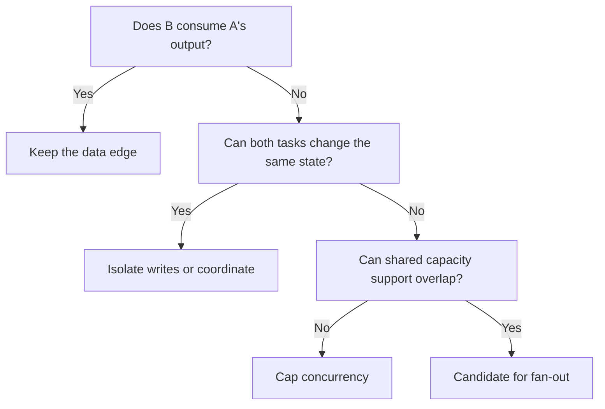
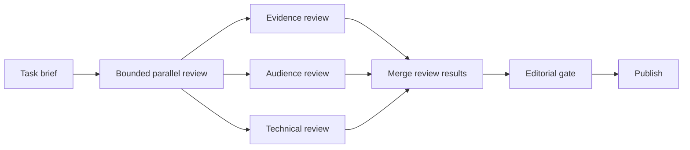

The pipeline-versus-graph debate begins with a false distinction. A workflow graph links tasks through directed dependencies. A pipeline is its one-path form. A directed acyclic graph, or DAG, may branch and merge but cannot return to an earlier task; a cyclic graph can revisit one.

I think the production rule is simple: choose the smallest topology that expresses the work honestly. Start linear unless independence is clear and serial execution would miss a real objective. More edges do not improve model judgment or reliability by themselves; evidence, validation, retries, and explicit failure handling do that work.

In short
Pipeline and graph are not opposites. Earn every branch, condition, and return edge from the work.

## Start with what waits

For each proposed edge, record why the downstream task must wait. A data dependency means it consumes an earlier result. A resource dependency means two tasks could change the same mutable resource, such as a file, database row, approval record, or workspace. Capacity is different: a shared API quota may require a concurrency limit without creating a correctness dependency.

[PostgreSQL, an open-source relational database, documents that a concurrent update to the same row may wait](https://www.postgresql.org/docs/current/transaction-iso.html). [Stripe, a payments platform, documents request-rate limits and simultaneous-request limits separately](https://docs.stripe.com/rate-limits). Shared immutable input is usually safe to read concurrently; shared writes are not.

I think this fake-edge test matters more than agent count. If B consumes none of A's output, the tasks share no mutable resource, and capacity permits overlap, A → B may be artificial.

| Shape | Use it when |
|---|---|
| Linear pipeline | Each stage needs the previous result and the route is known. |
| Fan-out/fan-in DAG | Independent jobs can start separately and later merge. |
| Conditional or cyclic graph | Current state selects the next route or sends work back under a stop rule. |
| Hybrid | A mostly linear route contains one bounded graph-shaped section. |

Fan-out/fan-in starts independent branches and later merges them. Removing a false serial edge may reduce elapsed time, but an all-required merge still waits for its slowest branch. [AWS Step Functions, Amazon's managed workflow service, specifies this wait for its Parallel state](https://docs.aws.amazon.com/step-functions/latest/dg/state-parallel.html). The critical path is the longest required chain, not an automatic speedup. I think a cycle belongs only where changed state can alter the route and a hard limit can stop the return.

In short
Separate consumed outputs, shared writes, and capacity limits, then choose the shape those facts require.

## Make the hybrid prove its branches

Consider this Content Engine as a design exercise. It turns a task brief and task-local evidence into an article. A possible production shape keeps the control route linear while allowing one bounded review burst before the editorial gate.

Branch only when inputs are stable and outputs isolated. Add a condition when runtime evidence changes the route. Add a cycle when work must return, but give it recorded state, an exit condition, and a hard attempt or cost limit. Otherwise, keep the burst acyclic.

Before fan-out, write the merge contract:

| Contract field | Decision to record |
|---|---|
| Branch set | Stable identities; required and optional branches. |
| Finish rule | Accepted terminal outcomes, minimum results, and deadline. |
| Failure policy | Retry, cancel, merge survivors, compensate a side effect, or escalate. |
| Attempt policy | Logical work identity, duplicate handling, and rejection of late results. |
| Replay record | Input versions, outputs, errors, attempts, and merge decision. |

The commit should be one indivisible state change, so an old attempt cannot reopen it. Retried side effects need idempotency, meaning the same logical request cannot repeat the effect; [Stripe's API contract is one documented implementation](https://docs.stripe.com/api/idempotent_requests). Ordinary code should count results, validate schemas, deduplicate attempts, and enforce routes. Models should handle the remaining judgment.

A mature workflow runtime can provide stored state, retries, and traces. It still cannot decide whether a branch is independent or a partial result acceptable. I think that application-level contract is the real architecture work.

This is a decision protocol, not production proof. Compare a capped trial with the serial baseline on elapsed time, cost per accepted article, missing results, and replay success. Set its window, budget, acceptance owner, stop threshold, and rollback owner beforehand. I think the hybrid is often strongest because it contains the coordination tax.

In short
A branch must beat its serial baseline and arrive with explicit merge, retry, replay, budget, ownership, and rollback rules.

## Meanwhile in sci-fi

Meanwhile in sci-fi

The Expanse (2015)

The useful contrast is a launch sequence versus a fleet engagement. One must remain ordered because each stage enables the next; the other needs independent units, branching decisions, and convergence.

The mapping is literal: a pipeline fits launch-like dependencies, while a graph fits genuinely independent or state-driven work. Turning the launch sequence into a fleet merely creates more mission-control software that can fail.

## Put the choice in writing

Before selecting a framework, answer four questions in an architecture decision record, a short document that preserves why a technical choice was made:

1. What must wait because it consumes an earlier result?
2. What can overlap without changing the same mutable resource?
3. Can runtime state change the next route or stopping condition?
4. Can the system detect, explain, and replay a partial failure?

Record the baseline, thresholds, changed data or vendor boundaries, approval owner, operator, funder, and rollback owner. Add risk or privacy review when permissions, exposure, retention, or human oversight changes. For more on feedback routes and exit conditions, see [“Everyone Discovered Loops. Nobody Agrees What the Word Means.”](/posts/everyone-discovered-loops/)

Choose the runtime after these answers. It can execute the shape, but it cannot make an unnecessary edge necessary.

In short
Record dependencies, runtime choices, failure replay, thresholds, boundaries, and owners before approving more topology.

