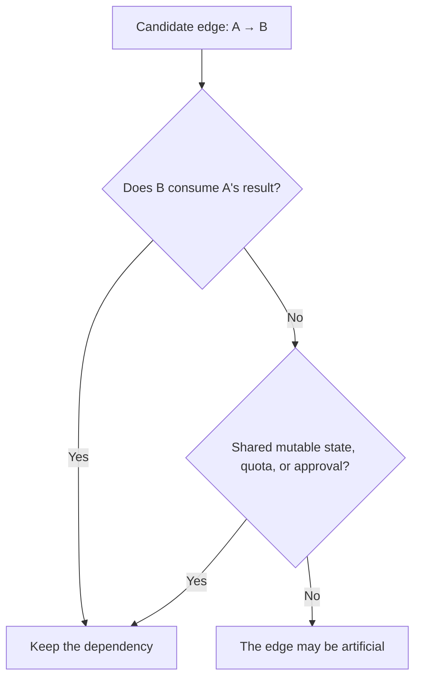
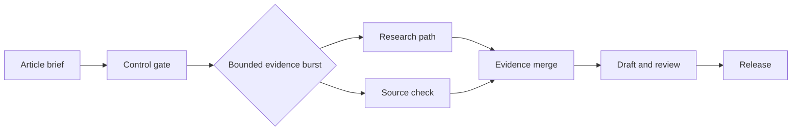

Calling a pipeline primitive and a graph advanced confuses tooling with structure. A pipeline is already a graph topology: one directed path through tasks. I think the production question is simpler and harder: what is the minimum shape that tells the truth about the work?

Arrows do not improve model judgment or reliability. Evidence, validation, retries, and operating controls do. Topology should express dependencies, not ambition.

In short
Choose the smallest topology that represents the workflow’s real sequence, independence, and runtime choices.

## Find the edges the diagram hides

Map data and resource dependencies first. A data dependency exists when B consumes A’s output or authorization. A resource dependency exists when tasks share a mutable resource: state they can change, such as a file, database row, workspace, approval, or API quota.

These hidden edges are real. [PostgreSQL, an open-source object-relational database](https://www.postgresql.org/docs/current/transaction-iso.html), documents that one updater can wait while another transaction holds or changes the same row. [Stripe, a payments platform](https://docs.stripe.com/rate-limits), documents concurrency limits separately from request-rate limits.

Apply the fake-edge test: if B does not consume A’s result and both can run without competing for mutable state, quota, or approval, their edge may be artificial. Reading the same immutable snapshot is not a write conflict. I think this test is more useful than counting agents.

In short
An edge is justified by consumed data or shared operational constraints, not by the boxes a framework makes easy to draw.

## Match topology to runtime behavior

Keep a linear pipeline when the route is known and every stage needs the previous result: ingest a request, validate its schema, apply policy, then persist it. I think this ordered path is often the strongest production design because replay, ownership, and recovery remain obvious. Keep counting, deduplication, schema checks, and fixed routing in deterministic code.

Use a DAG, a directed graph with no route back to an earlier task, when work is genuinely wide. Fan-out starts independent branches; fan-in merges them. Five separate market questions can run concurrently and converge into one report. Yet width shortens the critical path, the longest required chain, only when branches avoid shared bottlenecks. [AWS Step Functions, a managed state-machine service](https://docs.aws.amazon.com/step-functions/latest/dg/state-parallel.html), waits for every branch in a Parallel state to finish before continuing.

Choose conditional routing when recorded state selects the next edge. Add a cyclic graph, which can revisit earlier work, only when runtime state can require a retry or refinement. If the number of passes is known beforehand, an acyclic route is enough. I think every cycle needs a meaningful stop rule and a hard execution limit.

In short
Sequence calls for a pipeline, independent breadth for a DAG, and state-dependent routing or return for conditional and cyclic graphs.

## Make the graph pay its coordination bill

A partial failure means some branches finish while others fail, time out, or arrive late. Before fan-out, define branch identities, required outputs, deadlines, missing-result policy, and the merge rule. Record attempt numbers and accept results atomically so a stale retry cannot overwrite a completed decision. Idempotency means retrying one logical operation without repeating its effect; [Stripe’s API documentation](https://docs.stripe.com/api/idempotent_requests) shows that contract in practice.

A mature workflow runtime can provide stored state, retries, and error paths more cleanly than hand-built orchestration. It still cannot decide whether a missing branch invalidates the product, whether workspaces are isolated, or whether wider execution will breach a supplier quota. I think the merge, not the fan-out, is where a graph earns its place.

The Content Engine behind this article is an in-house article-production workflow. Without claiming its exact stages, a useful hybrid design keeps the control route linear and gives only evidence work a bounded burst:

This shape contains branch failures and duplicated cost inside one section. Start with bounded fan-out when work is already independent and the latency target requires it; “start linear” should not mean forced serialization. I think the hybrid is a strong production default because it localizes, rather than celebrates, complexity.

In short
Width is valuable only when its merge, retries, isolation, quotas, and replay behavior are explicit; a hybrid contains those obligations.

## Meanwhile in sci-fi

Meanwhile in sci-fi

Ender's Game (2013)

In the 2013 science-fiction film, a commander directs separate units through a changing space battle. The mapping is specific: a fleet engagement needs independent action, changing routes, and convergence, while a launch sequence remains ordered because each stage enables the next. Modeling that launch as a fleet only adds mission-control failure points.

## Promote complexity through a bounded test

Compare the proposed topology with a serial baseline for a fixed period and engineering budget. Name the business outcome and acceptance owner. Then set promotion and stop thresholds for end-to-end latency, accepted-output rate, review time, retry-inclusive cost, and replay success. Include rejected attempts and rollback effort in the cost per accepted result. No universal graph speedup can replace this local comparison.

Four questions are enough for the architecture review:

1. What must wait because it consumes an earlier result?
2. What can run independently without touching the same mutable resource?
3. Can runtime state change the next route or stopping condition?
4. Can the system detect, explain, and replay a partial failure?

If the third answer is no, resist a cycle. If the second is weak, resist fan-out. For deeper loop semantics and exit conditions, see [“Everyone Discovered Loops. Nobody Agrees What the Word Means.”](/posts/everyone-discovered-loops/). Once topology is chosen, “The 105 minutes after the graph” covers evaluation, typed state, and the trust layer that follows. Earn each extra edge with observed work and an operable failure policy.

In short
Measure against a bounded baseline, assign acceptance and stop authority, and promote only the smallest additional topology that produces a worthwhile result.

