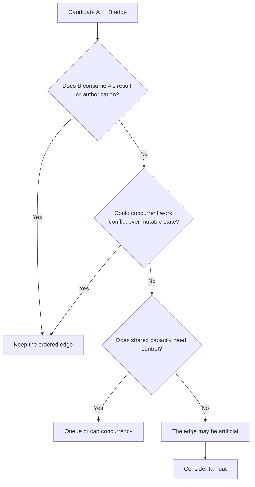
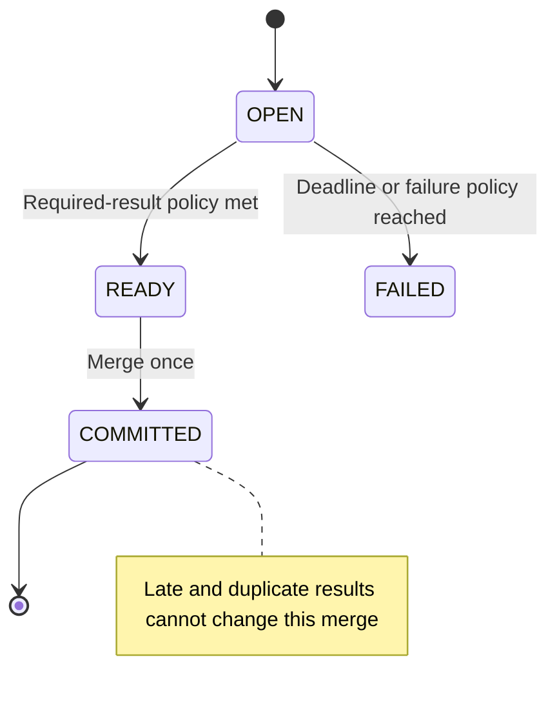
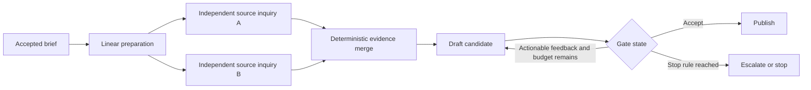

The number of agents tells you almost nothing about the topology they need. What matters is which result must exist before another task can start, which tasks can safely run together, and whether runtime state can change the route.

A pipeline, meaning one ordered path from stage to stage, is already a graph. I think treating it as the primitive option creates the wrong incentive: teams add branches before the work has proved that branches belong there. The better question is how little topology can represent the workflow honestly.

  In short
  
Choose topology from dependencies and runtime state, not from agent count or architectural status.

## Make every edge prove its dependency

Start with two kinds of constraint. A data dependency exists when task B consumes task A’s output, decision, or authorization. Resource coupling exists when separate tasks can alter the same mutable resource, meaning a shared file, database row, workspace, or other state they can change. [PostgreSQL, the open-source relational database, documents](https://www.postgresql.org/docs/current/transaction-iso.html) how concurrent updates can make one writer wait for another, which is why prompt independence is not enough.

A shared read-only snapshot does not create that conflict. An API quota is also a capacity constraint rather than a correctness dependency, although it may require a queue or concurrency cap. [Stripe, a payments platform, documents](https://docs.stripe.com/rate-limits) rate limits and simultaneous-request limits separately. I think the useful fake-edge test is strict: if B consumes nothing from A and the pair neither conflicts over mutable state nor exceeds shared capacity, the A → B edge may be artificial.

The shapes now follow. Keep a pipeline when the required work forms one path. Use a DAG, a directed acyclic graph with no route back to an earlier task, when independent work can fan out and later fan in at a merge. A conditional graph chooses its next edge from current state; a cyclic graph can return to earlier work. A hybrid confines one of those wider shapes to a bounded part of an otherwise linear route.

  In short
  
Keep edges for consumed results and conflicting writes; handle shared capacity with explicit queueing or concurrency limits.

## Promote topology under production conditions

When sequence is real, preserve it. Ingest request → validate schema → apply policy → persist result is linear because every stage needs the prior result. I think ordinary code should handle schema checks, counting, deduplication, and fixed routing; model calls belong where judgment is required. The visible order helps inspection, but replay still depends on captured inputs and controlled side effects.

A DAG becomes useful when a false serial edge is absent or removed. Removing one creates a different graph and may reduce total elapsed time; it does not make the fixed graph’s critical path, its longest required dependency chain, execute faster. An all-required merge still waits for its slowest required branch. [AWS Step Functions, a managed workflow service, makes that policy explicit](https://docs.aws.amazon.com/step-functions/latest/dg/state-parallel.html) in its Parallel state.

I think the merge is where breadth must earn its place. Declare branch identities, required or optional status, terminal states, output schema, deadline, and whether the merge needs every required result or a stated threshold. Retries that can repeat a write need idempotency: the same logical operation can be retried without repeating its effect, as [Stripe’s API contract illustrates](https://docs.stripe.com/api/idempotent_requests). Commit once, prevent late attempts from changing the result, and test duplicate, missing, late, cancelled, and out-of-order results. Record inputs, versions, and provenance for replay.

[AWS Step Functions also documents explicit Retry and Catch behavior](https://docs.aws.amazon.com/step-functions/latest/dg/concepts-error-handling.html). Such machinery can expose errors clearly, but it cannot choose the application’s required-result or late-arrival policy.

Runtime state can justify another route or a return edge. Use a cycle only when changed state can send work back, and give it a meaningful stop condition plus a hard step or spend limit. [LangGraph, a framework for stateful graph workflows, documents](https://docs.langchain.com/oss/python/langgraph/graph-api) state-based edges and bounded looping mechanics; [Everyone Discovered Loops. Nobody Agrees What the Word Means.](/posts/everyone-discovered-loops/) goes deeper on loop language and exits.

A deliberately simplified design option for this Content Engine shows why a hybrid is useful without claiming an exact stage map or a performance benchmark:

I think this bounded shape is often stronger than making the whole system cyclic. Measure the linear baseline, then set a trial owner, run and spend caps, acceptance and stop thresholds, and a rollback owner. Compare elapsed time, accepted evidence, total cost, throttling, partial failures, and replay success. The tech lead owns the topology change; the service owner accepts the result; security or privacy joins if data or vendor boundaries change.

The decision record should answer four questions: what must wait; what can run without a mutable-resource conflict; whether state changes the route or stop condition; and whether operators can detect, explain, and replay a partial failure. Once topology is chosen, *The 105 minutes after the graph* addresses the separate work of evaluation and typed state.

  In short
  
Promote a measured bottleneck into the smallest bounded branch or cycle whose merge, failure policy, budget, ownership, and rollback are explicit.

## Meanwhile in sci-fi

  Meanwhile in sci-fi
  
Battlestar Galactica (2004)

  
This 2004 science-fiction television series follows a surviving human fleet, which supplies a useful thought experiment. A launch sequence stays ordered because each clearance enables the next action; a fleet engagement needs independent units, changing routes, and convergence. The mapping is literal: keep required sequence in a pipeline, use a graph for genuine breadth or state-driven returns, and use a hybrid when only one part needs that coordination. Turning the launch into a fleet plan adds control paths without creating independent work.

