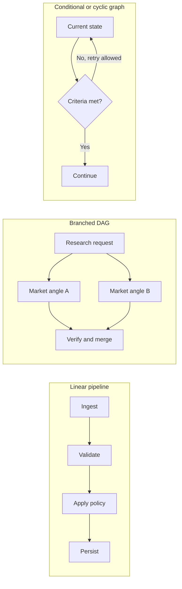
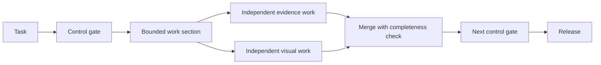

Pipeline versus graph is the wrong architecture split. A pipeline is a directed path: each stage passes data or control to the next, so it is already the smallest graph topology. A DAG, or directed acyclic graph, may branch and merge but never returns to an earlier node. A conditional graph chooses its next edge from current state; a cyclic graph can revisit a node.

I think production teams should choose the minimum shape that tells the truth about the work. Extra edges create recovery and coordination duties, while missing edges hide dependencies. Ask what must wait, what can safely run together, and what can only be decided at runtime.

In short

A pipeline, DAG, and cyclic graph are different shapes of the same thing. Choose the smallest shape that represents the workflow honestly.

## Draw the waits before the arrows

List each job’s inputs, outputs, writes, and scarce services. A data dependency exists when one job consumes another’s result. A mutable resource is a shared thing a job can change, such as a file, database row, workspace, or approval state. Quotas can also couple tasks: [PostgreSQL’s transaction documentation](https://www.postgresql.org/docs/current/transaction-iso.html) shows why concurrent database writers may wait, while [Stripe’s API documentation](https://docs.stripe.com/rate-limits) separates rate limits from limits on simultaneous requests.

Apply the fake-edge test. If job B does not consume job A’s output, and they do not compete for mutable state or limited capacity, forcing B to wait may be artificial. A shared read-only snapshot does not require sequence. I think this test is more useful than counting agents because it finds false sequence and unsafe parallelism.

Keep the first shape when every stage needs its predecessor and predictable replay matters. Fan-out/fan-in means starting independent branches and later merging them; use it for genuinely wide work. Add a condition or cycle only when runtime state changes the next action, and give every cycle a stop rule and hard budget. [LangGraph](https://docs.langchain.com/oss/python/langgraph/graph-api), a framework for stateful AI workflows, documents both state-based edges and execution limits. I think ordinary code should handle schema checks, counting, deduplication, and fixed routing; models belong where judgment is required.

In short

Remove an edge only when there is no data dependency and no shared-resource conflict. Add branches or cycles only for independence or route-changing state.

## Make the merge carry its own weight

Parallel work can shorten the critical path, the longest required chain from start to finish, but it promises no proportional speedup. [AWS Step Functions](https://docs.aws.amazon.com/step-functions/latest/dg/state-parallel.html), Amazon’s cloud workflow orchestrator, waits for every required parallel branch before continuing. A full merge therefore inherits its slowest required branch, the tail-latency mechanism explained in [The Tail at Scale](https://www.barroso.org/publications/TheTailAtScale.pdf), a 2013 peer-reviewed systems paper.

I think the merge contract is the real architecture decision. It must know which branches were expected, which arrived, what schema they use, where their evidence came from, and what a missing result triggers. Retried side effects also need idempotency, meaning the same logical attempt can run again without repeating the effect; [Stripe’s idempotency-key design](https://docs.stripe.com/api/idempotent_requests) is one production example. Add isolated workspaces, quota controls, branch traces, and replayable inputs as needed. More arrows provide none of these protections, and they do not improve model judgment.

In short

Fan-out earns its place only when the merge can account for slow, missing, failed, and retried branches without losing provenance or repeating effects.

## Meanwhile in sci-fi

Meanwhile in sci-fi

Battlestar Galactica (2004)

The 2004 television series contrasts ordered launch procedures with fleet combat, where separate units react to changing conditions and later coordinate.

The launch sequence maps to a pipeline because each completed state enables the next. The fleet engagement maps to a wider graph because units can act independently, choose routes from current conditions, and converge. Turning the launch sequence into a fleet graph would only create more mission-control paths that can fail.

## Keep the graph-shaped work bounded

At a deliberately high level, our Content Engine illustrates a hybrid: a linear control spine with a bounded graph-shaped section where independent work exists. I think this is often the strongest production shape because the main route stays easy to inspect while a local burst can earn wider coverage or lower latency.

Four questions are enough to inspect a candidate workflow:

1. What must wait because it consumes an earlier result?
2. What can run independently without changing the same resource?
3. Can runtime state change the next route or stopping condition?
4. Can the system detect, explain, and replay a partial failure?

If sequence dominates, keep the pipeline. If independent work adds value and its failures are governable, add the smallest DAG. If runtime state changes the route, add a condition or bounded cycle. For more on loop terminology and exit conditions, [“Everyone Discovered Loops. Nobody Agrees What the Word Means.”](/posts/everyone-discovered-loops/) takes that question further. “The 105 minutes after the graph” covers evaluation, typed state, and the trust plane once the topology is chosen.

In short

Keep a simple control spine, measure real bottlenecks, and promote only proven independent or state-dependent work into bounded graph-shaped sections.

