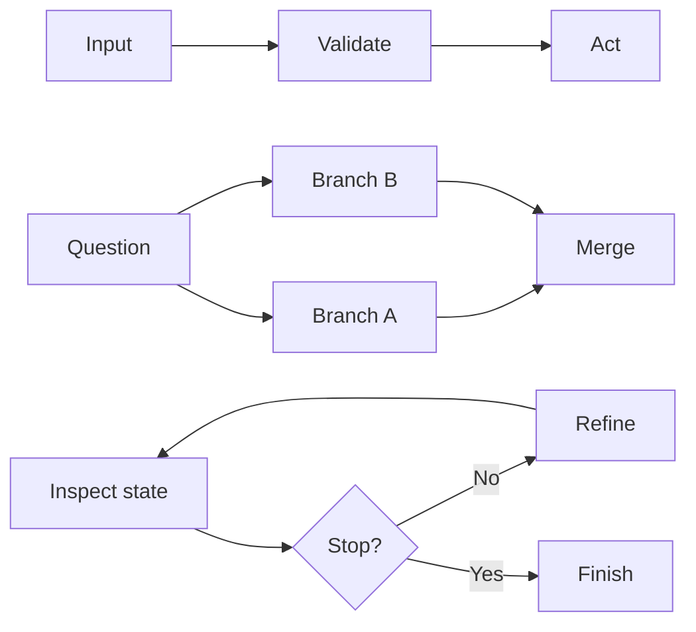
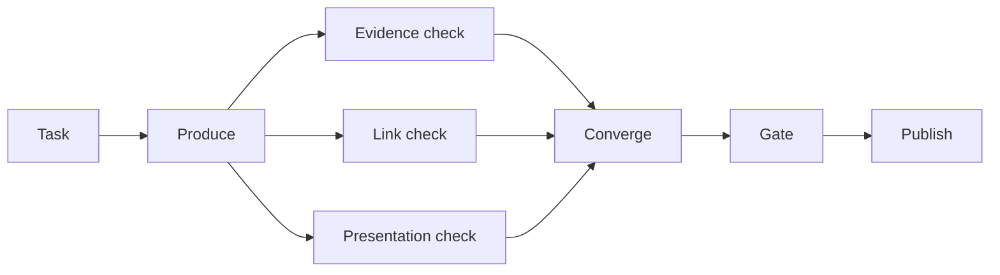

A pipeline is already a graph: one directed path through a set of tasks. That makes “pipeline or graph?” the wrong architecture question. [Apache Airflow](https://airflow.apache.org/docs/apache-airflow/stable/core-concepts/dags.html), an open-source workflow orchestrator, models this foundation as tasks plus the dependencies that decide their order and conditions.

The useful question is smaller: what is the minimum topology that tells the truth about this work? I think every branch, join, condition, and return edge should have to answer it.

  In short
  
Choose topology from the shape of the work, not from how advanced the diagram looks.

## Draw the waits before the arrows

For each task, record what it consumes and every shared thing it can change. A **mutable resource** is a file, database row, workspace, or other shared object a task can modify. Tasks may exchange no data and still collide through that resource, an approval gate, or an API quota. [PostgreSQL](https://www.postgresql.org/docs/current/transaction-iso.html), an open-source relational database, documents one mechanism: a writer may wait for another concurrent writer.

Then apply the fake-edge test. If B does not consume A’s result, and both can run together without a shared write, lock, quota, or approval conflict, the A → B edge may be artificial. Two branches can read the same immutable snapshot without creating a write conflict. I think this test reveals more than the number of agents ever will.

  In short
  
Map data dependencies and shared-resource conflicts before deciding which work is independent.

## Match the topology to the work

Keep a **pipeline**, one ordered directed path, when sequence is real: ingest a request → validate its schema → apply policy → persist the result. Each stage needs the preceding output or decision, while validation and routing can remain deterministic code.

Use a **branched DAG**, a directed acyclic graph with no route back to an earlier node, when work is genuinely wide. **Fan-out** starts independent branches; **fan-in** merges their results. Researching several market angles fits if resources are isolated and the merger can identify every expected result. I think a DAG earns its place through that independence, not through node count.

Use a **conditional graph** when current state selects the next route, and a **cyclic graph** when that route may revisit earlier work. An error-based retry can justify a cycle; a fixed two-pass review can stay acyclic. [LangGraph](https://docs.langchain.com/oss/python/langgraph/graph-api), a stateful agent-workflow framework, documents state-based edges and execution limits. Every cycle needs a stop condition and a hard step or cost cap. Topology alone does not improve judgment. The companion article [“Everyone Discovered Loops. Nobody Agrees What the Word Means.”](/posts/everyone-discovered-loops/) goes deeper on feedback and exit conditions.

  In short
  
Use a line for real sequence, a DAG for independent breadth, and state-based routing only when the next step can change at runtime.

## Make the merge carry its weight

Parallel work can shorten the **critical path**, the longest required chain before completion. Yet a full join still inherits its slowest required branch. [Amazon Web Services Step Functions](https://docs.aws.amazon.com/step-functions/latest/dg/state-parallel.html), a cloud workflow service, waits for every parallel branch to terminate. Computer systems researchers Jeffrey Dean and Luiz André Barroso explain this tail-latency effect in their 2013 paper [“The Tail at Scale”](https://www.barroso.org/publications/TheTailAtScale.pdf).

A merge needs expected branch identities, output schemas, provenance, deadlines, and a [failed-result policy](https://docs.aws.amazon.com/step-functions/latest/dg/concepts-error-handling.html). Retried side effects also need **idempotency**, meaning a logical request can repeat without repeating its effect; [Stripe](https://docs.stripe.com/api/idempotent_requests), a payments API provider, documents one implementation. Add isolated workspaces, [quota-aware concurrency](https://docs.stripe.com/rate-limits), and branch-level traces. Parallel model calls can also multiply tokens and tool use. I think the merge is the real graph decision because reliability comes from these controls, not extra arrows.

  In short
  
Parallelism pays only when its latency or coverage gain exceeds the cost of joins, retries, isolation, limits, and explainable partial failure.

## Meanwhile in sci-fi

  Meanwhile in sci-fi
  
The Expanse (2015)

  
In this science-fiction television series, a launch procedure follows an ordered sequence, while a fleet engagement distributes decisions across ships that must coordinate again.

The mapping is architectural: pipeline work resembles the launch procedure because each stage enables the next. Independent units, changing routes, and later convergence justify the fleet-shaped graph. Turning an ordered sequence into that graph only creates more control software that can fail.

## Keep graph-shaped work bounded

I think the hybrid is the strongest default for many production systems: keep a linear control spine and insert short graph-shaped sections only where work widens or the route changes. At a high level, this site’s Content Engine, the system that moves an article from task to publication, offers an example. Independent checks can spread out and converge before one gate moves the article forward.

This is a topology sketch, not a map of code or exact stages. The backbone keeps ownership and replay visible; the bounded burst adds breadth. Obvious independent, time-critical calls can fan out immediately. Starting linear should never mean inventing sequence.

The companion article “The 105 minutes after the graph” covers evaluation and typed state once topology is chosen. Before approving another edge, ask:

1. What must wait because it consumes an earlier result?
2. What can run independently without touching the same mutable resource?
3. Can runtime state change the next route or stopping condition?
4. Can the system detect, explain, and replay a partial failure?

Choose the smallest topology that answers all four honestly, then let measured bottlenecks earn additional complexity.

  In short
  
Keep a simple control spine, localize necessary graph behavior, and promote complexity only when measured work and governed failure make the case.

