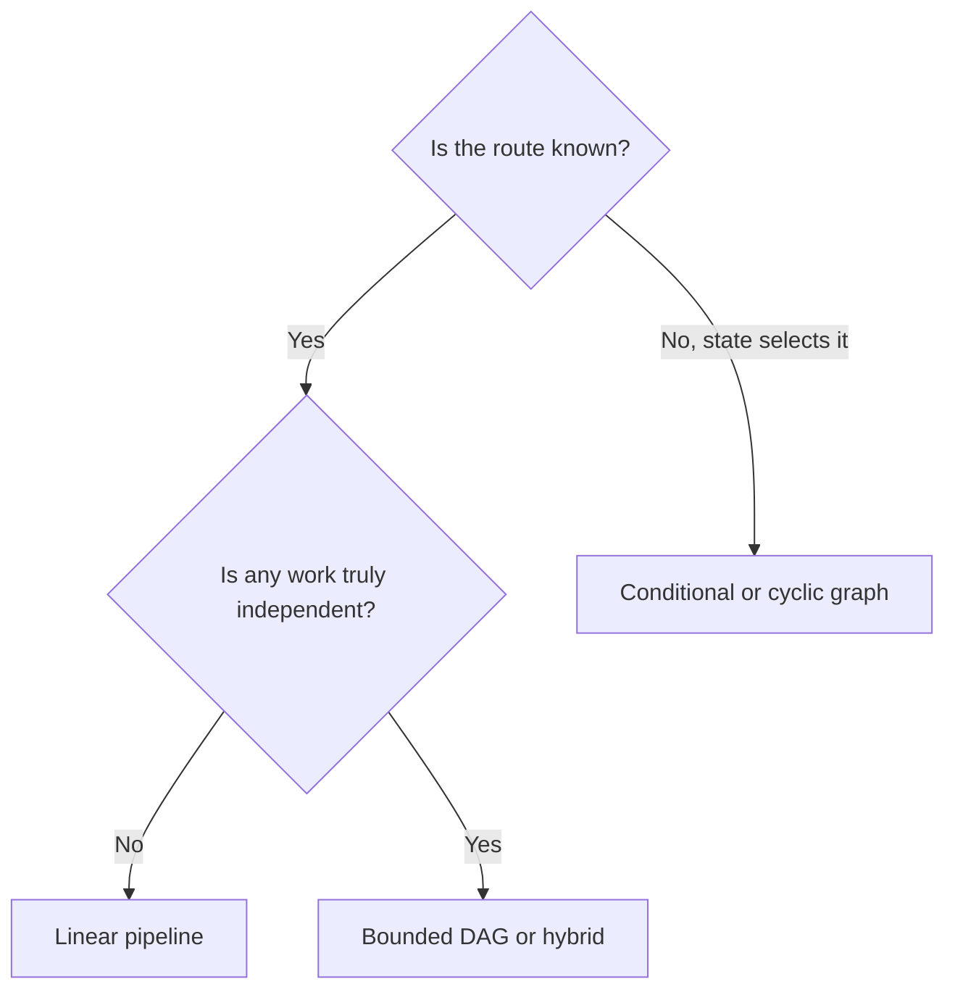
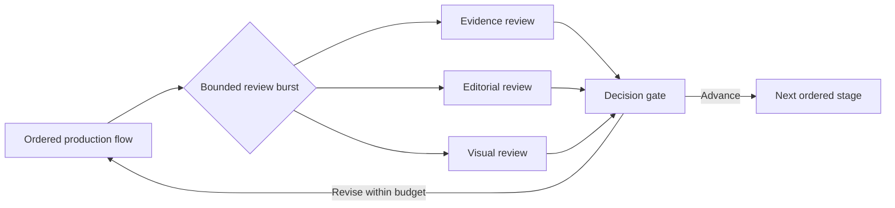

A pipeline is already a graph: one directed path through a set of stages. Branches and loops add stronger claims about which work can run independently and whether current state can change the route. They do not improve model judgment by themselves.

The useful question is: what is the smallest topology that expresses the workflow honestly? I think sophistication starts with removing unnecessary coordination, not drawing more of it.

In short

Choose topology from the work's dependencies and runtime decisions, not from the number of agents or the features of an orchestration framework.

## Find the edges you cannot remove

An edge is a dependency that makes one stage wait. Some edges carry data: policy checks need valid input from schema validation. Others protect a shared mutable resource, meaning something both jobs can change, such as a file, database row, approval lock, or workspace.

Limits create dependencies too. [Stripe, a payments API provider, documents separate rate and concurrency limits](https://docs.stripe.com/rate-limits). [PostgreSQL, an open-source database, documents how competing writers may wait on one another](https://www.postgresql.org/docs/current/transaction-iso.html). Tasks that look independent can still collide in production.

Ask four questions before selecting a runtime:

1. What must wait because it consumes an earlier result?
2. What can run independently without touching the same mutable resource?
3. Can runtime state change the next route or stopping condition?
4. Can the system detect, explain, and replay a partial failure?

A shared read-only snapshot does not force sequence, while a shared write often does. I think the fake-edge test is simple: if B consumes nothing from A and they share no mutable resource or quota, the A-to-B edge is suspect.

In short

Map data flow and resource conflicts. Apparent independence is irrelevant when branches contend for the same state, approval, or capacity.

## Match the topology to the work

A linear pipeline fits a known route in which each stage needs the previous result. Consider ingest request → validate schema → apply policy → persist result. The order is real, replay is easy to reason about, and deterministic validation, counting, deduplication, and routing can remain ordinary code.

A directed acyclic graph, or DAG, has directed dependencies but no route back to an earlier node. Fan-out/fan-in starts independent branches and later merges their results. Researching five separate market angles fits this shape if the branches do not race on shared state. [AWS Step Functions, Amazon's managed workflow service, specifies that its parallel state waits for every branch to finish](https://docs.aws.amazon.com/step-functions/latest/dg/state-parallel.html). I think the merge is the real architecture decision because it defines what counts as complete.

A conditional graph selects the next edge from current state. A cyclic graph can return to earlier work, as with a retry, refinement pass, or human escalation. [LangGraph, a framework for stateful model workflows, documents state-based edges and bounded looping](https://docs.langchain.com/oss/python/langgraph/graph-api). A cycle needs a meaningful stop condition and a hard cap. For a deeper treatment, [“Everyone Discovered Loops. Nobody Agrees What the Word Means.”](/posts/everyone-discovered-loops/) examines feedback-loop terminology and exit conditions.

In short

Use a pipeline for real sequence, a DAG for bounded breadth, and a conditional or cyclic graph only when state can alter the route or trigger a return.

## Pay for the join before buying the fan-out

Parallel work removes serial waiting only when branches are independent. A full merge still inherits its slowest required branch, part of critical-path latency: the time taken by the longest chain that must finish. Google engineers Jeffrey Dean and Luiz André Barroso explain the mechanism in their 2013 paper [“The Tail at Scale”](https://www.barroso.org/publications/TheTailAtScale.pdf): component-level variation matters more when one request waits for many components.

A merge must know which branches were expected, preserve each result's source, and expose missing work. It needs a deadline and an explicit failure policy: fail, retry, accept survivors, or escalate. [AWS documents that an unhandled state error fails a Step Functions execution by default](https://docs.aws.amazon.com/step-functions/latest/dg/concepts-error-handling.html). A retried write also needs idempotency, meaning the same logical request can repeat without duplicating its effect; [Stripe documents one implementation](https://docs.stripe.com/api/idempotent_requests). I think a topology is earned only when its gain exceeds this coordination tax.

In short

Fan-out creates a join contract. Slow branches, partial failure, safe retries, provenance, and missing results must be designed rather than assumed away.

## Meanwhile in sci-fi

Meanwhile in sci-fi

Battlestar Galactica (2004)

The 2004 science-fiction television series gives us a useful contrast: a launch sequence stays ordered because each stage enables the next, while a fleet engagement requires independent units, branching decisions, and convergence.

The mapping is precise. A sequential workflow gains nothing from being managed like a fleet, while genuinely independent work needs coordination that one ordered path cannot express.

## Keep the graph-shaped work bounded

A simplified Content Engine makes the hybrid concrete without exposing its exact implementation. The main production flow remains ordered, while evidence, editorial, and visual reviews run as bounded branches against one immutable draft snapshot. Their results converge at a gate that advances the article or returns it for another capped pass.

If every reviewer edits the same file, those branches are not independent; isolate their outputs or restore sequence. I think this hybrid is a strong production default because it confines coordination to the work that benefits from it.

Start with the smallest truthful shape and instrument it. Measure branch duration, throttling, retries, merge completeness, and replay. If independent, latency-sensitive work is already proven, branch from the start rather than serializing it by ritual. Otherwise let each new edge arrive as evidence.

In short

A linear backbone with short, isolated graph-shaped sections keeps the main route understandable while allowing measured parallelism and bounded feedback where they genuinely help.

