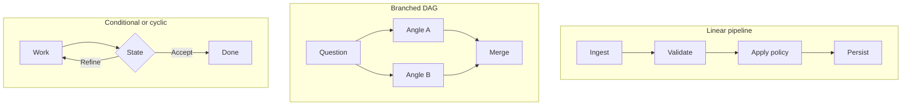
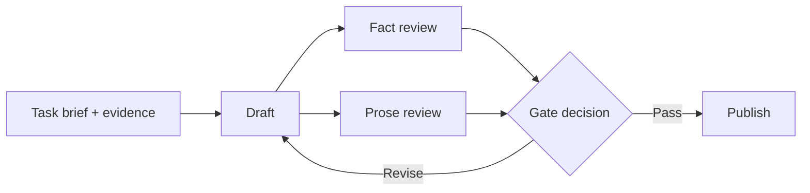

Calling a pipeline primitive because it has fewer arrows confuses complexity with fit. A pipeline is already a graph: one ordered path. A directed acyclic graph (DAG) may branch and merge but cannot return to an earlier task; a conditional graph chooses its next edge from current state, while a cyclic graph may revisit a task.

I think production systems should use the minimum topology that represents their real dependencies. Extra arrows add coordination, while judgment and reliability still depend on evidence, validation, retries, and explicit failure handling.

In short

Pipeline, DAG, cycle, and hybrid are points on one spectrum; the work’s dependencies and changing state should choose among them.

## Draw dependencies before topology

List what each job reads, produces, and can change. B has a data dependency on A when it consumes A’s result. Two jobs have a resource dependency when both can change the same file, database row, workspace, or approval state. [PostgreSQL, an open-source object-relational database, documents](https://www.postgresql.org/docs/current/transaction-iso.html) how one updater may wait for another touching the same row, which is the kind of hidden conflict an agent diagram can miss.

Capacity limits are different. [Stripe, a payments platform, documents](https://docs.stripe.com/rate-limits) request-rate and simultaneous-request limits separately. A shared quota may need a queue, backpressure, or concurrency cap, but it does not necessarily justify a semantic A → B edge. I think the useful fake-edge test is this: if B consumes none of A’s output and the jobs share no conflicting mutable resource, their sequence is probably artificial. Reading the same immutable snapshot does not create that conflict.

In short

Remove an edge only after checking consumed outputs and shared mutable resources; govern shared capacity without inventing false sequence.

## Make the merge explicit

Keep the pipeline when each stage truly needs the prior result, as in ingest → schema validation → policy check → persistence. The route is known, replay is easy to follow, and deterministic code can handle validation, counting, deduplication, and routing.

Fan-out/fan-in starts independent jobs and later merges their results. Concurrent scheduling does not shorten the critical path of a fixed graph, meaning its longest chain of dependent work. Removing an artificial edge creates a different graph that may finish sooner, although queueing and merge work remain. [AWS Step Functions, Amazon’s managed workflow service, specifies](https://docs.aws.amazon.com/step-functions/latest/dg/state-parallel.html) that its Parallel state waits for every branch to terminate. An all-required merge therefore still waits for its slowest branch.

I think the merge is the real architecture decision:

| Merge decision | Minimum contract |
|---|---|
| Expected work | Named branches and required or optional status |
| Closure | All required results or a stated minimum, plus a deadline |
| Retries | Attempt identity, duplicate protection, and late-result policy |
| Recovery | Captured inputs and versions, failure outcome, and branch replay |

Idempotency means retrying the same logical operation without repeating its effect; [Stripe’s official API documentation](https://docs.stripe.com/api/idempotent_requests) shows one implementation. Once a merge closes, a late result should start a new attempt rather than rewrite history. Replay also needs the original inputs, versions, and merge rule. Partial failure requires a declared choice: fail, retry, merge survivors, or escalate.

A condition or cycle earns its place only when current state changes the route or stopping decision. I think a known number of passes should remain acyclic; a runtime-driven return needs a meaningful exit condition and a hard execution cap. The deeper terminology and ownership questions belong in [“Everyone Discovered Loops. Nobody Agrees What the Word Means.”](/posts/everyone-discovered-loops/).

In short

Breadth pays only when the merge defines completion, failure, retries, late results, and replay; a cycle also needs a state-based reason to return and stop.

## Meanwhile in sci-fi

Meanwhile in sci-fi

Battlestar Galactica (2004)

<em>Battlestar Galactica</em>, a science-fiction television series that began in 2004, separates ordered launch procedures from fleet engagements. The workflow mapping is precise: a launch stays linear because each stage enables the next, while independent units in an engagement need branching decisions and convergence. Modeling the launch as a fleet only adds coordination software that can fail.

## Keep graph-shaped work bounded

At a high level, this Content Engine offers a useful hybrid example without exposing its implementation. A task brief and task-local evidence feed an ordered production path. Reviews that only read the same fixed draft can fan out; their outcomes converge at a gate, and only a revision decision creates a return path.

I think this is the practical production default: keep the control spine linear and localize the graph-shaped work. Before promotion, record the linear baseline, test window and budget, expected latency or coverage gain, accepted-output threshold, full cost, partial failures, and replay result. Name who funds the test, who accepts the output, and who can stop or roll it back.

The architecture review then comes down to four questions:

1. What must wait because it consumes an earlier result?
2. What can run independently without a conflicting mutable resource?
3. Can runtime state change the next route or stopping condition?
4. Can the system detect, explain, and replay a partial failure?

If most waits are real, keep the pipeline. When independent work and governable failure are both visible, add only the branch, condition, or cycle that the evidence has earned.

In short

Use a linear backbone with measured, owned graph-shaped bursts, and promote complexity only when the gain beats its coordination and recovery cost.

