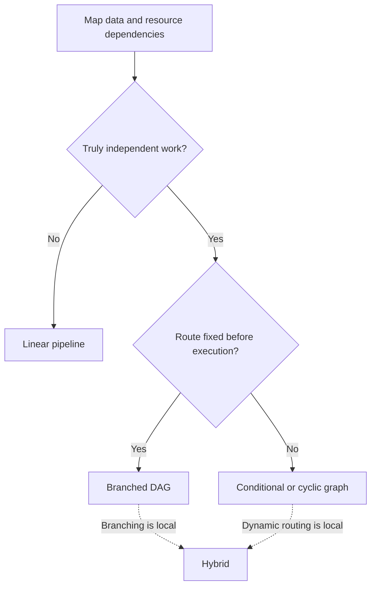
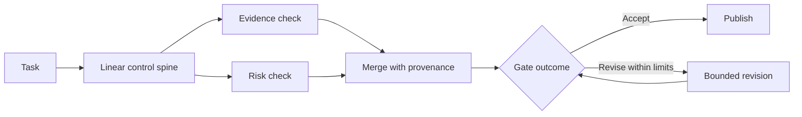

AI workflow diagrams look more advanced as their arrows multiply. Production systems do not. A pipeline is already a graph: one directed path. I think the useful question is how little topology can express the work honestly.

Start with a measured path. Add branches for proven independence, then add conditions or cycles only when current state can change the next action. More arrows expand execution options; they do not improve model judgment. Each addition brings obligations around failure, replay, cost, and visibility.

In short

Choose the minimum topology that matches the workflow’s real dependencies and runtime decisions.

## Draw the edges that actually exist

A data dependency is obvious when policy application must wait for validated input. Hidden dependencies matter too. Jobs that exchange no output may still write to the same file, update the same database row, wait on one approval, or compete for one API quota. A mutable resource is simply a shared thing a task can change.

The documentation for [PostgreSQL, an open-source relational database](https://www.postgresql.org/docs/current/transaction-iso.html), shows one writer waiting on another transaction. [Stripe, a payments platform with a production API](https://docs.stripe.com/rate-limits), separately limits request rate and simultaneous requests. I think an edge is fake only when neither task needs the other’s result and they have no such resource conflict. Reading the same immutable snapshot creates no write conflict, although the service providing it may still impose a shared quota.

In short

Map both data flow and shared resources before deciding that jobs can run in parallel.

## Match the topology to the route

Keep a **linear pipeline** for a known sequence such as ingest request → validate schema → apply policy → persist result, where each stage consumes or authorizes the next. Use a **DAG**, or directed acyclic graph, when independent jobs can fan out and later fan in, merging without any route returning to an earlier node. Researching five market angles independently and merging supported findings is one example.

A **conditional graph** chooses its next edge from current state. A **cyclic graph** can revisit an earlier node, which fits a retry or refinement process whose result determines whether to stop. Give every cycle a meaningful stop condition and a hard step or cost limit. If that behavior is local, use a **hybrid**: a linear spine with a short graph-shaped section.

I think schema checks, counting, deduplication, join completeness, and routing predicates should remain deterministic code where possible. Models belong where judgment is required. Starting linear is a default, not a ritual: if required calls are already independent and serial execution would break the latency objective, begin with a bounded DAG.

In short

Use sequence for dependency, a DAG for fixed breadth, a conditional or cyclic graph for state-dependent routes, and a hybrid when complexity is local.

## Price the merge, not just the fan-out

Parallel execution can shorten elapsed time when independent jobs were serialized, but completion remains constrained by the slowest required branch and the critical path, the longest chain of dependent work. [AWS Step Functions, Amazon Web Services’ managed state-machine service](https://docs.aws.amazon.com/step-functions/latest/dg/state-parallel.html), runs parallel branches concurrently where possible but waits for every branch before continuing. The 2013 peer-reviewed article [“The Tail at Scale”](https://www.barroso.org/publications/TheTailAtScale.pdf), by computer scientists Jeffrey Dean and Luiz André Barroso, explains why slow outliers matter more when a result needs many components.

I think the merge is the real architecture decision. It must know which branches were expected, expose missing results, preserve source provenance, and decide whether to fail, retry, accept survivors, or escalate. Retried side effects need **idempotency**, meaning repeating the same logical operation produces no additional effect; [Stripe documents one concrete implementation](https://docs.stripe.com/api/idempotent_requests). Isolated workspaces, rate control, branch-level traces, and measured token use complete the bill.

In short

A fan-out earns its place only when the merge can govern slow, missing, failed, and replayed branches.

## A hybrid view of the Content Engine

At a deliberately high level, the Content Engine behind this site illustrates the hybrid. A task follows a clear control spine, while bounded evidence checks branch where independence helps. Results converge with provenance, and a gate can advance the article or return it for limited revision.

I think this is stronger than making the entire system one large cyclic graph. The backbone stays easy to inspect, while the coordination tax remains confined to work that benefits from breadth or a state-driven return path.

In short

A linear backbone with bounded branches and returns keeps non-linear behavior visible and contained.

## Meanwhile in sci-fi

Meanwhile in sci-fi

The Expanse (2015)

This television series shows both tightly ordered spacecraft procedures and fleet engagements in which separate units act on changing information.

The mapping is precise: a launch sequence needs ordered dependencies, while a fleet engagement needs independent action, branching decisions, and convergence. Giving the launch procedure a fleet topology adds mission-control failure points without changing the work.

## Ask four questions before adding an arrow

For any workflow, ask:

1. What must wait because it consumes an earlier result?
2. What can run independently without touching the same mutable resource?
3. Can runtime state change the next route or stopping condition?
4. Can the system detect, explain, and replay a partial failure?

If sequence dominates, keep the pipeline. If independent branches exist and their failures are governable, introduce the smallest DAG that expresses them. Add a condition or cycle only when state demands it, and instrument each step before promoting more complexity.

[“Everyone Discovered Loops. Nobody Agrees What the Word Means.”](/posts/everyone-discovered-loops/) goes deeper on feedback paths and exit conditions. “The 105 minutes after the graph” covers evaluation and typed state once the topology is chosen. The decision here comes first: every arrow should explain a dependency, choice, or return the work genuinely needs.

In short

Start with real dependencies, prove independence, demand recoverable failures, and add only the topology the work can justify.

