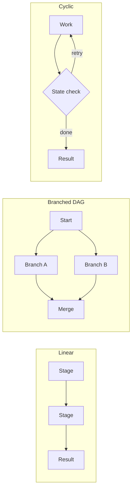
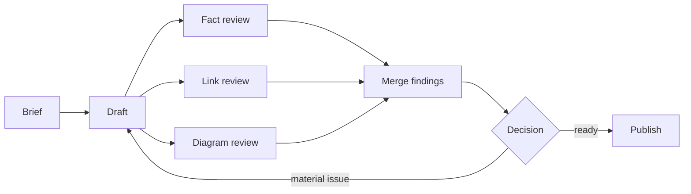

A pipeline is a graph with its nodes joined in one ordered path. A DAG, short for directed acyclic graph, can branch but cannot return to an earlier node. A cyclic graph permits that return. These are topology choices, not maturity levels.

In production, choose the minimum shape that tells the truth about the work. I think architectural maturity is visible in the edges a team can remove, not the arrows it can draw.

In short

Use one path for real sequence, branches for independent work, and returns for state-driven repetition.

## Find the real edges

Draw each job's inputs and outputs, then its resource use. A mutable resource is anything a task can change, such as a file, database row, approval lock, or workspace. Two jobs may exchange no data and still conflict there. [PostgreSQL, an open-source relational database, shows](https://www.postgresql.org/docs/current/transaction-iso.html) how one concurrent update may wait for another. [Stripe, a payments API provider, distinguishes request-rate limits from active-concurrency limits](https://docs.stripe.com/rate-limits), so shared quotas can create edges too.

Apply the fake-edge test: if B does not consume A's result and both can run together without a shared write, lock, or quota conflict, A → B may be artificial. Reading the same immutable snapshot is usually safe. Otherwise, keep the sequence. Ingest request → validate schema → apply policy → persist result is a strong pipeline because each step consumes or authorizes the next. I think schema checks, counters, deduplication, and fixed routing belong in ordinary code wherever possible.

In short

Data flow and shared operational constraints justify edges. Agent count does not.

## Design the merge before the branches

Use a branched DAG when work is genuinely wide. Fan-out starts independent jobs; fan-in merges their results. Five market angles, for example, can be researched separately and reduced into one report.

Concurrency only removes serial waiting from the critical path, meaning the longest required chain of work. It does not promise a fivefold speedup. [AWS Step Functions, a managed workflow service, runs parallel branches concurrently and waits for all required branches to finish](https://docs.aws.amazon.com/step-functions/latest/dg/state-parallel.html). A full join therefore inherits its slowest required branch, the mechanism described in the 2013 distributed-systems paper [“The Tail at Scale”](https://www.barroso.org/publications/TheTailAtScale.pdf).

I think the merge is the real architecture decision. It needs expected branch identities, output schemas, provenance, a deadline, and a missing-result policy. Retried writes also need idempotency: repeating the same logical request must not repeat its effect, as [Stripe's retry contract illustrates](https://docs.stripe.com/api/idempotent_requests).

In short

Parallelize breadth only when the join can identify every branch, govern failures, and replay work safely.

## Let state earn the return path

A conditional graph chooses its next edge from current state. A cyclic graph revisits earlier work. Use either when an evidence score selects a verification route, a retryable failure triggers another attempt, or a review result requires refinement.

I think a cycle earns its place only when a recorded state change alters what happens next. If two passes are known in advance, draw two stages in a DAG. A real cycle needs a meaningful stop rule and a hard step or cost cap. [LangGraph, an open-source framework for stateful agent workflows, documents state-based edges and recursion limits](https://docs.langchain.com/oss/python/langgraph/graph-api). For a deeper treatment of feedback terminology, see [“Everyone Discovered Loops. Nobody Agrees What the Word Means.”](/posts/everyone-discovered-loops/)

In short

Add a condition or cycle only when runtime state changes the route, and make the return reason and stop rule explicit.

## Keep the coordination tax local

Branches bring partial failures, isolated workspaces, rate limits, retries, traces, and multiplied model calls. More arrows supply none of those controls. I think the practical production default is often a hybrid: a simple control spine with short graph-shaped bursts.

Consider a deliberately simplified Content Engine example, not its exact implementation. Several reviewers read the same immutable draft and return separate reports. Their findings converge at one decision point, which may reopen the draft.

The backbone stays understandable, while concurrency remains in read-only review. Reliability still comes from explicit failure policy, isolated outputs, visible provenance, and replayable decisions.

In short

A hybrid confines graph complexity to the work that earns it while preserving a clear production route.

## Meanwhile in sci-fi

Meanwhile in sci-fi

Battlestar Galactica (2004)

The 2004 television series pairs ordered Viper launch procedures with battles involving many independently moving units. One demands sequence; the other demands branching decisions and convergence.

Mapped to workflow architecture, the launch procedure is a pipeline and the fleet engagement is a graph. Turning the ordered procedure into a web of choices adds mission-control failure points without improving the mission.

## Ask four questions before adding an edge

Before changing topology, ask:

1. What must wait because it consumes an earlier result?
2. What can run independently without touching the same mutable resource or quota?
3. Can runtime state change the next route or stopping condition?
4. Can the system detect, explain, and replay a partial failure?

Start with the smallest truthful answer, then measure branch time, throttling, retries, join completeness, and replay success. Starting linear is a default, not dogma: when independent calls are already required and the latency target cannot tolerate serial work, a small DAG may be the honest starting point. Once topology is chosen, evaluation, typed state, and trust become the next problem; that is the subject of “The 105 minutes after the graph.”

In short

Earn each branch or cycle with a real dependency, a measurable benefit, and a failure contract the system can explain and replay.

