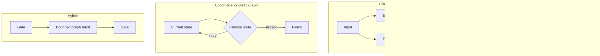
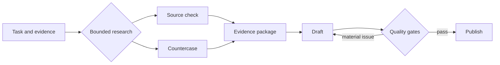

Agent-workflow architecture is often presented as a maturity ladder: pipelines below, graphs above. That confuses visual complexity with architectural fit. A pipeline is already a graph topology, just one directed path through tasks. I think the production question is whether each extra branch, choice, or return represents something the work truly requires.

Choose the minimum topology that expresses data dependencies, shared-resource conflicts, and runtime decisions. By themselves, more arrows do not create better judgment or reliability; explicit evidence, validation, retries, and failure policies do.

In short
The strongest topology is the smallest one that represents the workflow honestly.

## Find the edges that are real

Start with outputs, not agents. A data edge is real when task B consumes task A’s result. A resource edge is real when both jobs touch a mutable resource, meaning a shared thing they can change or exhaust: a file, database row, workspace, API quota, or approval gate.

These hidden edges matter. [PostgreSQL, an open-source object-relational database, documents](https://www.postgresql.org/docs/current/transaction-iso.html) how one writer can wait when another transaction has changed or locked the same row. [Stripe, a payments platform, separately documents](https://docs.stripe.com/rate-limits) API rate and concurrency limits. Jobs can therefore be independent in data while still competing operationally.

I think an edge should survive two questions: does one job consume the other’s output, and can they conflict through a shared mutable resource? If both answers are no, the edge may be artificial. A shared immutable snapshot does not by itself create write contention.

In short
Remove fake sequence only after checking both data flow and shared-resource conflicts.

## Match the topology to the route

Once the edges are honest, the available shapes become easier to distinguish.

A pipeline fits when every stage needs the prior result or authorization. For example: receive the payload, check its schema, apply policy, and persist the result. I think this visible order is often the strongest production artifact because replay and ownership stay obvious.

A DAG, or directed acyclic graph, contains no route that returns to an earlier task. Use fan-out to start genuinely independent jobs and fan-in to merge them. Parallel work can shorten the critical path, the longest-duration chain of dependent work, but a full merge cannot finish before its slowest required branch. [AWS Step Functions, Amazon Web Services’ managed workflow service, waits for every branch in a Parallel state to finish](https://docs.aws.amazon.com/step-functions/latest/dg/state-parallel.html) before continuing.

Use a conditional graph when current state selects the next route, and a cyclic graph when that route can revisit earlier work. [LangGraph, a framework for stateful agent workflows, documents](https://docs.langchain.com/oss/python/langgraph/graph-api) both state-based edges and bounded looping execution. I think a cycle earns its place only when a recorded state change justifies returning and an explicit stop rule limits the return.

In short
Sequence calls for a pipeline, independent breadth for a DAG, and state-dependent returns for a bounded cycle.

## Make the merge pay its coordination tax

The fan-out is easy to draw. The merge carries the production obligation. It must know which branches were expected, which are required, when to stop waiting, and what to do with missing, failed, cancelled, or late results.

[Idempotency](https://docs.stripe.com/api/idempotent_requests) means repeating one logical request without repeating its effect; it matters when a retried branch writes, sends, or purchases. Provenance, the record of where each result came from, must survive the merge so a partial replay can reconstruct the decision. Branches also need isolated workspaces or explicit write coordination.

I think deterministic code should own schemas, deduplication, counters, routing predicates, and join completeness. Models should handle judgment. An orchestrator may provide retries and traces, but it cannot decide which degraded result the business should accept.

In short
Breadth is useful only when the system can explain, control, and replay an incomplete merge.

## Use a linear spine with bounded width

For the Content Engine behind this article, consider a deliberately simplified design sketch, not a map of its current implementation or exact stages.

The sketch is a hybrid: a linear backbone, a local DAG for independent evidence work, and a conditional return when a gate finds a material issue. I think this keeps coordination near the work that earns it instead of spreading graph semantics across the whole system.

In short
A bounded hybrid localizes branching and returns while preserving a clear production route.

## Meanwhile in sci-fi

Meanwhile in sci-fi

Ender's Game (2013)

The 2013 science-fiction film gives us the fleet half of the comparison: independent units move, react, and converge during battle. A launch sequence, by contrast, has ordered dependencies. The mapping is direct: the fleet may justify branches and state-based routes, while turning the launch into a fleet graph merely adds mission-control software that can fail.

## Promote complexity with evidence

“Start linear” should not become dogma. If independent, time-critical calls are known from the start, a DAG may already be the smallest truthful topology. Otherwise, establish a serial baseline and ask four questions:

1. What must wait because it consumes an earlier result?
2. What can run independently without touching the same mutable resource?
3. Can runtime state change the route or stopping condition?
4. Can the system detect, explain, and replay a partial failure?

Set a fixed test period and engineering budget, then name the acceptance owner, business outcome, and stop or promotion thresholds. Compare end-to-end latency, accepted outcomes, retry-inclusive cost, review effort, and replay success; count rejected attempts too. This is a decision protocol, not evidence that a hybrid wins everywhere.

For a deeper treatment of return paths, see [“Everyone Discovered Loops. Nobody Agrees What the Word Means.”](/posts/everyone-discovered-loops/). Once the shape is chosen, evaluation and typed state become the separate concern explored in “The 105 minutes after the graph.”

In short
Measure the linear baseline, then add only the branch, route, or return that proves its value.

