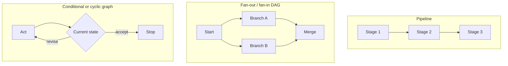
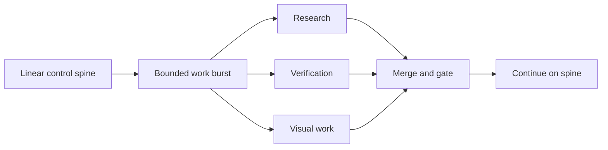

Every extra edge in a production workflow creates a promise about order, state, and recovery. If the system cannot explain that promise when a branch fails, the diagram is describing ambition rather than architecture.

A pipeline is already a graph: a single directed path through several stages. So “pipeline or graph?” is the wrong decision. I think the useful question is how little topology can express the work truthfully while keeping cost, replay, and ownership clear.

In short
Choose topology from dependencies and runtime behavior, then require every added branch or return path to justify its coordination cost.

## Find the edges that are actually there

Start with dependencies, not agent count. A **pipeline** is an ordered path. A **DAG**, or directed acyclic graph, can branch but has no route back to an earlier node. A **cyclic graph** permits that return, usually because current state calls for another attempt or a different action.

The visible data edges are only half the map. Two jobs may not consume each other’s output, yet both can change the same mutable resource, meaning a shared file, database row, workspace, approval slot, or external system. [PostgreSQL, the open-source relational database, documents](https://www.postgresql.org/docs/current/transaction-iso.html) how one concurrent writer may wait for another; [Stripe, a payments API provider, separately documents](https://docs.stripe.com/rate-limits) rate and concurrency limits. Those constraints can couple apparently independent work.

Apply the fake-edge test: if B does not need A’s result, and both can run together without conflicting writes, locks, approvals, or quotas, the A → B edge is suspect. Shared read-only input is fine. Shared mutation may require isolation or ordering rather than optimistic parallelism.

In short
Remove an edge only after checking both data flow and shared resources; prompt-level independence is not enough.

## Match the shape to the route

Keep a straight pipeline when each stage needs the previous result and the route is known: ingest a request → validate its schema → apply policy → persist the result. I think this visibly ordered path is often the strongest production artifact because replay and recovery have an obvious sequence. Validation, counting, deduplication, and fixed routing should remain ordinary deterministic code; model calls belong where judgment is genuinely required.

Use **fan-out/fan-in** when bounded jobs can start independently and later merge. Researching five market angles, verifying each result, and combining the surviving evidence is a legitimate branched DAG. Parallel execution can remove serial waiting, but it does not guarantee an equal speedup or better judgment.

A conditional edge is warranted when current state selects the next route. A cycle is warranted when state can send work back, such as a retryable error or refinement against a defined acceptance test. I think a cycle earns its place only with a reason to return, a meaningful stop condition, and a hard step or cost limit. If the number of passes is known beforehand, an acyclic path is usually more honest.

For a deeper treatment of feedback terminology and exit conditions, see [*Everyone Discovered Loops. Nobody Agrees What the Word Means.*](/everyone-discovered-loops-nobody-agrees-what-the-word-means/).

In short
Use a line for real sequence, a DAG for independent breadth, and a conditional or cyclic route only when state can change what happens next.

## Design the join before the fan-out

The merge is where breadth becomes an operational commitment. [Amazon Web Services’ Step Functions documentation](https://docs.aws.amazon.com/step-functions/latest/dg/state-parallel.html), describing its managed workflow service, makes one common contract explicit: a parallel state waits for all its branches to finish before continuing. An all-branch join is therefore bounded by its slowest required branch, plus queueing and orchestration overhead.

I think the merge is the real architecture decision. It must know which branches were expected, expose missing results, preserve source provenance, and declare whether failure means retry, continue with survivors, or escalate. A retried side effect also needs **idempotency**, a stable request identity that prevents the same write or send from happening twice. Isolated workspaces, quota controls, branch-level traces, and replayable inputs complete the bill.

In short
Fan-out earns its place only when the system can govern the slowest branch, partial results, duplicate effects, and a reproducible merge.

## Keep graph-shaped work local

A hybrid often keeps the production boundary understandable: one linear control spine, with short branched or conditional sections where the work demands them. I think this should be the default design hypothesis, rather than a mandate to make the entire workflow linear or graph-shaped.

Our Content Engine is a useful high-level example. Its path toward an article release can remain gated and ordered while bounded research, verification, and visual work branch and rejoin before the next gate. This is an architectural sketch, not a claim about its exact internal stages.

In short
A hybrid confines coordination overhead to the parts that need breadth or state-based routing while preserving a clear main path.

## Meanwhile in sci-fi

Meanwhile in sci-fi

Battlestar Galactica (2004)

The television series separates tightly ordered launch operations from engagements in which deployed units split, react, and regroup.

The mapping is architectural: an ordered production sequence resembles the launch operation, while independent research and verification resemble deployed units with a planned convergence point. Giving ordered work the topology of a fleet engagement adds mission-control machinery without creating useful independence.

## Promote topology from evidence

Ask four questions before changing the shape:

| Question | Architecture signal |
|---|---|
| What must wait because it consumes an earlier result? | Keep that sequence in the pipeline. |
| What can run without conflicting over mutable resources? | Consider a bounded fan-out/fan-in DAG. |
| Can runtime state change the route or stop condition? | Consider a conditional edge or cycle. |
| Can partial failure be detected, explained, and replayed? | If not, the wider graph is not production-ready. |

When in doubt, start linear and instrument the bottleneck. If independent, latency-sensitive work is already proven, use bounded fan-out rather than inventing sequence. Add state-based routing only when observed state really changes the next action. Once the topology is chosen, [*The 105 minutes after the graph*](/the-105-minutes-after-the-graph/) addresses the next problem: typed state, evaluation, and the trust controls around execution.

In short
Measure first, promote only proven independence or state-dependent routing, and choose the smallest graph that tells the truth about the work.

