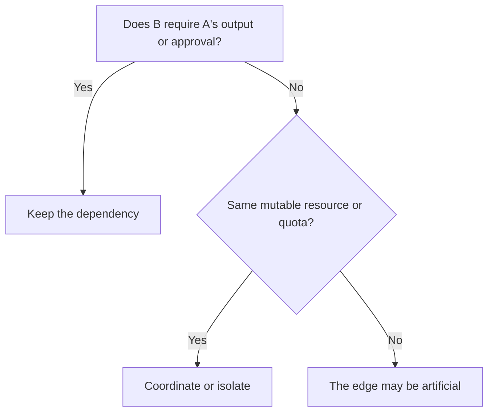
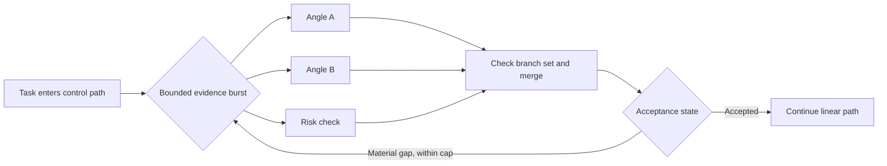

A pipeline and a graph are not competing categories. A pipeline is one directed path through a graph, and that simple shape is often exactly what production work needs.

I think the useful architecture question is: what is the smallest topology that represents the work without hiding a dependency or inventing coordination? Begin with that shape, which will often be linear. If independent work is already proven and latency matters, draw the branch immediately rather than imposing a fake sequence.

In short

Topology should describe the workflow’s real dependencies and runtime choices, not the team’s ambition.

## The merge is the first production decision

A branched DAG, or directed acyclic graph, allows work to fan out into independent branches and fan in at a later merge, without any route returning to an earlier task. [AWS Step Functions, Amazon Web Services’ managed state-machine service](https://docs.aws.amazon.com/step-functions/latest/dg/state-parallel.html), makes one consequence explicit: its Parallel state waits for every branch to finish before continuing. Parallel work can shorten the critical path, the longest required chain, but an all-required merge still inherits its slowest branch.

That makes the merge more important than the extra arrows. It needs the expected branch identities, an output schema, a deadline, a source record, and a policy for partial failure, where some branches succeed and others do not. I think it should also reject unknown or late attempts and record why, so a replay produces the same decision.

Retries add another obligation. Idempotency means repeating one logical operation without repeating its effect; [Stripe, a payments platform, documents this contract](https://docs.stripe.com/api/idempotent_requests) for safely retried API requests. A graph does not supply that protection by itself.

In short

Fan-out earns its place only when the merge can identify, validate, recover, and replay every required result.

## Some edges are hidden outside the data flow

A data dependency exists when task B consumes task A’s output or an approval decision A obtains. A resource dependency exists when apparently separate tasks contend for a mutable resource, meaning a shared file, row, workspace, quota, or other thing they can change or exhaust.

These conflicts are concrete. [PostgreSQL, an open-source object-relational database](https://www.postgresql.org/docs/current/transaction-iso.html), documents one updater waiting when another transaction has changed or locked the same row. [Stripe documents](https://docs.stripe.com/rate-limits) concurrency limits separately from request-rate limits. In both cases, tasks can be independent on paper and coupled in operation.

I think the fake-edge test is simple: if B does not consume A’s result, and both can run without racing on mutable state or exhausting a shared limit, the A-to-B edge is suspect. Reading the same immutable snapshot does not create a conflict.

In short

Map consumed outputs and shared resources before deciding that two tasks are either sequential or independent.

## Let changing state choose the shape

Once the edges are honest, the options become clearer. Keep a linear pipeline for a known route such as ingest request, validate schema, apply policy, then persist result. Use a fan-out/fan-in DAG for bounded independent work, such as researching several market angles before merging the supported findings.

A conditional graph selects its next edge from recorded state. A cyclic graph can revisit earlier work when that state calls for another attempt, refinement, or escalation. [LangGraph, a framework for stateful agent workflows](https://docs.langchain.com/oss/python/langgraph/graph-api), documents both state-based edges and looping execution. A useful cycle still needs a meaningful stop rule and a hard execution cap; topology alone does not improve judgment.

I think the practical production shape is often a hybrid: a linear control path containing short graph-shaped bursts. Consider our Content Engine, the system coordinating evidence and article production, as a high-level design example rather than a literal inventory of its internal stages:

The model can handle judgment inside a bounded task. Branch counting, schema checks, deduplication, routing rules, and execution caps should remain deterministic code whenever possible.

In short

Use linear order for real sequence, a DAG for real width, a conditional or cyclic graph for state-driven routes, and a hybrid when only part of the workflow needs those powers.

## Meanwhile in sci-fi

Meanwhile in sci-fi

The Expanse (2015)

The television series separates tightly ordered ship procedures from fleet engagements in which independent units react and converge. The mapping is architectural: a launch sequence resembles a pipeline because each stage enables the next, while a fleet engagement resembles a graph because units can branch on changing state. Turning the launch sequence into a fleet plan would add coordination without creating useful independence.

## Earn one additional edge at a time

A mature workflow runtime can make persisted state, retries, and traces easier to implement. It still cannot decide whether a missing branch invalidates the result, whether a late write is safe, or whether wider execution is worth its cost. Those remain application decisions.

Parallel model branches can also repeat context and tool calls. Count that extra use, along with isolated workspaces, rate-limit handling, and branch traces, in the coordination cost.

Instrument the smallest truthful topology as a baseline, then put any promotion behind a bounded test. Record the test window, engineering budget, business acceptance outcome and owner, end-to-end latency, retry and review effort, full cost per accepted result, replay success, stop thresholds, and rollback owner. The available evidence supports this protocol, not a universal claim that one topology wins across production systems.

I think complexity should move one edge at a time. Before approving it, ask:

1. What must wait because it consumes an earlier result?
2. What can run independently without touching the same mutable resource?
3. Can runtime state change the next route or stopping condition?
4. Can the system detect, explain, and replay a partial failure?

If the answer reveals a measured bottleneck, add the smallest branch, condition, or return path that removes it. For a deeper treatment of what counts as runtime feedback, see [“Everyone Discovered Loops. Nobody Agrees What the Word Means.”](/posts/everyone-discovered-loops/)

In short

Promote topology only against a measured baseline, a declared failure contract, and a bounded operational budget.

