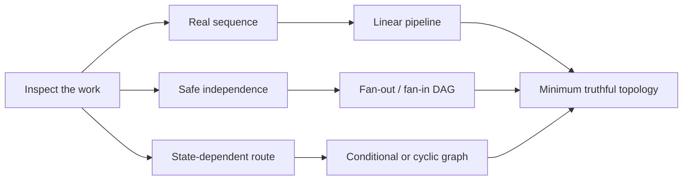
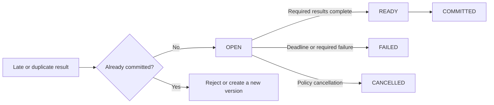
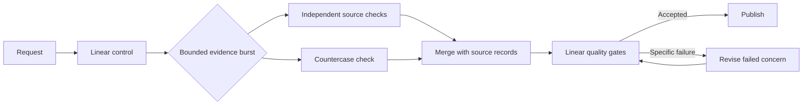

Graph tooling makes it easy to draw impressive workflows before proving the work needs them. I think this reverses the architecture decision. A pipeline is one ordered path through tasks, which means it is already a graph. [Apache Airflow, an open-source workflow orchestrator, describes](https://airflow.apache.org/docs/apache-airflow/stable/core-concepts/dags.html) a workflow in terms of tasks and their execution dependencies.

The real choice begins with three properties of the work: sequence, safe independence, and state-dependent routing. Agent count tells you none of them.

In short
Choose topology from dependencies and runtime state, not from how many agents a framework can display.

## Find the real waits

Mark what each task consumes and changes. A data dependency is obvious: policy cannot be applied until a request has been validated. A mutable resource is a shared object a task can change, such as a file, database row, approval record, or workspace. Tasks writing to the same object may need isolation or order even if neither consumes the other’s output. [PostgreSQL, the open-source relational database, documents](https://www.postgresql.org/docs/current/transaction-iso.html) how one concurrent row update can wait for another.

Capacity is related but different. A shared read-only snapshot creates no write conflict, while an API quota can limit overlap without creating a logical dependency. [Stripe, a payments platform, documents](https://docs.stripe.com/rate-limits) rate limits and simultaneous-request limits separately. Handle that constraint with a queue or concurrency cap rather than pretending B needs A’s result.

Now apply the fake-edge test: if B does not consume A’s output, the tasks do not conflict through mutable state, and capacity controls permit overlap, the A-to-B edge may be artificial. Otherwise, keep it. I think `ingest → validate schema → apply policy → persist` is strongest as a visible pipeline because each stage needs the previous result or authorization, while replay and ownership stay easy to inspect.

In short
Remove an edge only after ruling out data dependence, shared writes, and operational capacity constraints.

## Design the merge before adding width

A directed acyclic graph, or DAG, has directed edges but no route back to earlier work. Fan-out/fan-in starts independent branches and later merges their results. Concurrent execution can reduce elapsed time against an artificial serial schedule. It does not shorten the critical path, the longest required dependency chain, of a fixed graph; removing an artificial edge creates a new graph with a different critical path.

The merge sets the contract. [AWS Step Functions, Amazon’s managed workflow service, specifies](https://docs.aws.amazon.com/step-functions/latest/dg/state-parallel.html) that its Parallel state waits until all branches terminate. Your merge may require named branches, accept a declared minimum, or fail at a deadline, but it must say which. An all-required merge still waits for its slowest required branch plus merge overhead.

I think the merge deserves more attention than the fan-out. Give each branch an identity, output schema, source record, deadline, and final outcome such as completed, failed, or cancelled. A retried write also needs idempotency, meaning the same logical request can repeat without duplicating its effect; [Stripe’s API contract illustrates this boundary](https://docs.stripe.com/api/idempotent_requests). After commitment, reject a late result or create a new version. Treat `COMMITTED → ACCEPT_LATE` as illegal, and replay duplicate, missing, late, cancelled, and out-of-order results in tests. Parallel model calls can repeat context and tool use, so compare whole-run cost. A mature runtime may help implement these controls, but it cannot remove the obligation.

In short
A branch earns its place only when the system can identify, bound, merge, and replay its outcomes.

## Let state earn the return edge

A conditional graph chooses the next task from current state. A cyclic graph can return to earlier work. Use either when a result changes the route: evidence triggers another check, a retryable failure returns to a safe operation, or review sends one concern back for refinement. Keep known passes acyclic. When runtime state can cause a return, define a meaningful stop condition and a hard step or cost cap. [LangGraph, an open-source framework for stateful workflows, exposes](https://docs.langchain.com/oss/python/langgraph/graph-api) conditional edges, loops, and an execution limit, but those mechanics do not improve judgment by themselves.

I think a strong production default is a hybrid: a linear control path with short graph-shaped bursts. The Content Engine behind this article offers a high-level example. Evidence work can branch, converge with source records, and rejoin ordered quality gates; a specific failure can trigger a bounded return instead of restarting everything.

Keep counting, schema validation, duplicate detection, routing rules, and merge completeness in deterministic code. Use models where the work requires judgment, and never confuse parallel review with independent truth.

In short
Use conditions and cycles for state-driven decisions, while keeping the rest of production deliberately simple.

## Meanwhile in sci-fi

Meanwhile in sci-fi

The Expanse (2015)

As a metaphor set in this science-fiction television series, compare a launch sequence with a fleet engagement. The sequence must stay ordered because each stage enables the next; the engagement needs independent units, branching decisions, and convergence. The mapping is direct: a pipeline fits the first problem, a graph fits the second, and swapping their shapes adds control software without improving the work.

## Promote topology from evidence

Instrument the linear baseline before widening it, unless independent, latency-critical calls are already obvious. Record elapsed time, accepted output quality, total cost, throttling, retries, merge completeness, and replay success. Set a bounded test window, spending limit, acceptance threshold, and rollback owner before implementation. This is a decision protocol, not a production benchmark.

Four questions are enough for the architecture review:

1. What must wait because it consumes an earlier result or authorization?
2. What can overlap without sharing a mutable resource?
3. Can runtime state change the next route or stopping condition?
4. Can the system detect, explain, and replay a partial failure?

I think complexity should enter through measured promotion. If evidence does not justify a branch, remove it; if state never changes the route, remove the condition or cycle. For deeper treatment of feedback, exit conditions, and ownership, see [“Everyone Discovered Loops. Nobody Agrees What the Word Means.”](/posts/everyone-discovered-loops/)

In short
Start with the smallest honest shape, then promote only the topology whose production benefit exceeds its coordination tax.

