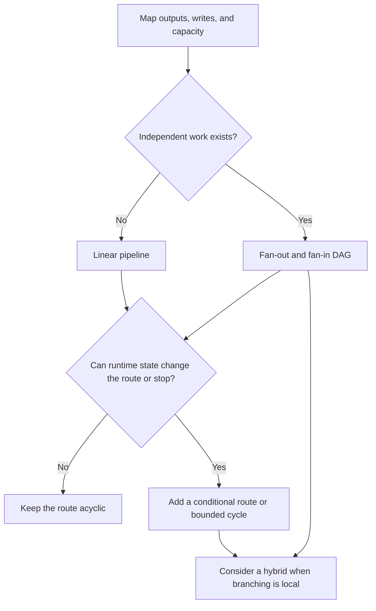
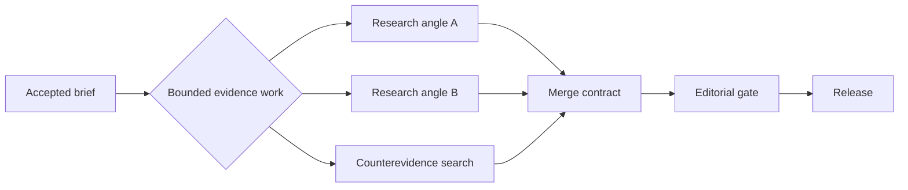

Pipeline and graph are often presented as different levels of sophistication, but they belong to the same family. A workflow graph connects tasks through directed dependencies; a pipeline is its simplest topology, one ordered path. A directed acyclic graph, or DAG, may branch and merge but cannot return to an earlier task. A cyclic graph can.

I think production teams should choose the smallest topology that accurately represents the work, measure it, and add breadth or return paths only when real dependencies or runtime state demand them. Extra edges create failure and recovery work. They do not improve model judgment by themselves.

In short
A pipeline is already a graph. Choose its shape from real order, concurrency, and state changes.

## Map the work before naming the topology

Map two constraints. A data dependency is required for correctness: B waits for A’s result. A mutable resource can be changed, so separate tasks may conflict on a shared file or database row. A quota does not impose a correctness order, but it limits safe concurrency.

Use the fake-edge test. If B does not consume A’s output, the tasks share no mutable write, and downstream capacity supports both, the A-to-B edge may be artificial. [PostgreSQL, an open-source relational database, shows why concurrent row updates may wait](https://www.postgresql.org/docs/current/transaction-iso.html); [Stripe, a payments platform, documents request-rate and simultaneous-request limits separately](https://docs.stripe.com/rate-limits). The first reveals a shared-state conflict; the second reveals shared-capacity pressure.

When each stage consumes the last result, keep intake → validation → policy → persistence linear. Retries and replay remain easy to inspect.

Fan-out/fan-in starts independent jobs and later merges their results. The critical path is the longest chain of required work. Removing an artificial edge may shorten that chain, but an all-required merge still waits for its slowest branch and adds overhead. [AWS Step Functions, Amazon’s managed workflow service, specifies that its Parallel state waits for every branch to terminate](https://docs.aws.amazon.com/step-functions/latest/dg/state-parallel.html). I think a DAG earns its place only when wider execution is useful and governable.

A conditional graph chooses the next task from current state; a cyclic graph can revisit earlier work. [LangGraph, an open-source framework for stateful agent workflows, documents both mechanics](https://docs.langchain.com/oss/python/langgraph/graph-api). Use them when state changes the route or stop rule. If every pass is known in advance, stay acyclic. A linear backbone with one bounded graph-shaped section is a hybrid.

In short
Check consumed outputs, shared writes, and capacity. Add branches for real breadth and cycles for state-driven returns.

## Test the choice on a bounded hybrid

As a worked design exercise, imagine this Content Engine with a linear path and a bounded evidence stage. This sketch makes no claim about its current implementation or performance.

The merge needs a contract before the branches start.

| Merge question | Required decision |
|---|---|
| Which results count? | Stable identities, required or optional status, output shape, and source trail |
| When does it close? | All required results or a stated minimum, plus a deadline |
| How can work end? | Succeeded, failed, cancelled, or timed out, with retry or escalation rules |
| What follows commit? | Late or duplicate results cannot change the output; replay starts a new attempt |

I think the merge contract should precede the fan-out. A retried side effect needs idempotency, meaning a repeated logical request does not duplicate its effect; [Stripe’s API contract is one implementation](https://docs.stripe.com/api/idempotent_requests). Branches need immutable inputs, isolated workspaces, or controlled writes. [AWS Step Functions also documents configured retries and catches](https://docs.aws.amazon.com/step-functions/latest/dg/concepts-error-handling.html), but the application still defines failure.

I think ordinary code should handle branch counts, duplicate detection, output-shape checks, and fixed routes. Models belong where judgment is needed. That boundary exposes the coordination tax: repeated context, partial failures, late results, source tracking, and harder replay.

In short
A hybrid localizes useful breadth, but its merge must define results, failure, late arrivals, retries, isolation, and replay.

## Meanwhile in sci-fi

Meanwhile in sci-fi

Battlestar Galactica (2004)

<em>Battlestar Galactica</em>, the 2004 science-fiction television series, contrasts an ordered fighter launch with a fleet engagement shaped by independent units and changing conditions. The mapping is direct: prerequisites belong in a pipeline, while independent action, changing routes, and convergence can justify a wider or cyclic graph.

## Make every extra edge earn promotion

“Start linear” does not mean serializing independent, time-sensitive work. If required calls can safely run together from day one, a bounded DAG may be the smallest truthful start. I think the decision still needs a baseline: median and 95th-percentile elapsed time, full run cost, accepted-output rate, branch failures, and replay success.

Set a test window and engineering budget, with success, stop, and rollback thresholds. Name owners for architecture approval, platform operation, result acceptance, and rollback. Add security, privacy, or procurement when data, permissions, or suppliers change. This is a decision protocol, not production proof.

Record four answers:

1. What must wait because it consumes an earlier result or approval?
2. What can run independently without a shared mutation and within available capacity?
3. Can runtime state change the next route or stopping condition?
4. Can the system detect, explain, and replay a partial failure?

For return paths, see [“Everyone Discovered Loops. Nobody Agrees What the Word Means.”](/posts/everyone-discovered-loops/) The separate article “The 105 minutes after the graph” covers evaluation, typed state, and trust after topology selection. Here, add an edge only when the work and evidence can defend it.

In short
Measure the alternative, assign owners and stop limits, and promote complexity only when its value beats its coordination cost.

