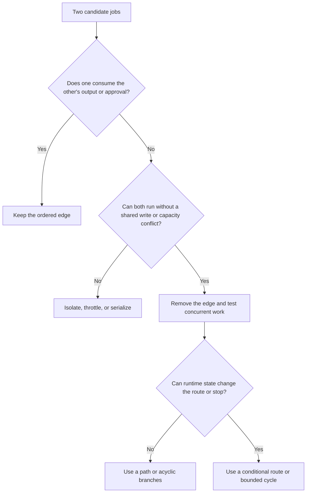
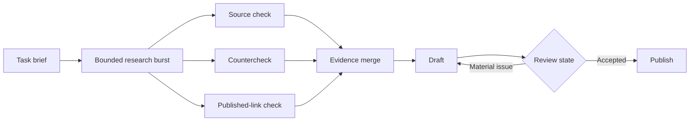

Every arrow in an AI workflow is an operational claim: one job must wait, two jobs can safely separate, or runtime state can send work elsewhere. If the runtime cannot explain that claim, the diagram is too complicated.

A pipeline, an ordered sequence in which each required stage hands work to the next, is already a graph. It is simply one path. I think teams make better production choices when they stop ranking shapes by sophistication and choose the least coordination that still represents the work accurately. That may mean branching immediately when independent calls are already required; “start linear” should never become permission to serialize real breadth.

In short

Demand evidence that every edge represents waiting, safe independence, or state-driven routing.

## Read the waits before drawing the route

A data dependency exists when task B consumes task A’s output or an approval A obtains. Resource coupling is different: logically independent tasks can collide through a mutable resource, meaning a shared file, database row, workspace, or other thing both can change.

[PostgreSQL, an open-source relational database, documents](https://www.postgresql.org/docs/current/transaction-iso.html) one concurrent update waiting on another touching the same row. [Stripe, a payments platform, separately documents](https://docs.stripe.com/rate-limits) rate and concurrent-request limits. A quota is a capacity constraint rather than a correctness dependency, but it may still require queueing or lower concurrency. A shared read-only input creates no write conflict.

Apply the fake-edge test: if B consumes nothing from A, needs no approval from A, and can run beside A without a write conflict or capacity breach, the A-to-B edge is suspect. I think this test reveals more than counting agents because it exposes the actual reason for sequence.

In short

Remove a serial edge only after checking consumed outputs, shared writes, and capacity.

## Choose the smallest shape that survives failure

Keep a pipeline when the route is known and every stage needs the prior result. A DAG, or directed acyclic graph, can fan out into independent branches and fan in at a merge, with no route back to an earlier task. A conditional graph selects the next edge from current state; a cyclic graph can revisit earlier work. A hybrid keeps a linear spine and confines branching or cycling to a bounded section.

Removing a fake serial edge creates a different graph and may shorten its critical path, the longest chain of required dependencies. It does not accelerate a fixed graph’s critical path. An all-required merge still waits for its slowest required branch and adds overhead. [AWS Step Functions, Amazon Web Services’ managed state-machine service, makes that wait explicit](https://docs.aws.amazon.com/step-functions/latest/dg/state-parallel.html) for its Parallel state.

I think the merge is the real production decision. It needs expected branch identities, required or optional status, a quorum (the minimum acceptable result count), terminal states such as succeeded, failed, and cancelled, a deadline, cancellation policy, attempt IDs that reject stale results, and a merge state that can be committed only once. After commitment, accepting a late result is illegal. Rehearse duplicate, missing, late, cancelled, and out-of-order results. Keep counts, schema checks, duplicate checks, and routing conditions in deterministic code; use models where judgment is actually required. Those obligations are the coordination tax.

Retries that can repeat a write need idempotency, meaning the same logical operation can be repeated without repeating its effect; [Stripe documents this contract for retried API requests](https://docs.stripe.com/api/idempotent_requests). Where that is impossible, define an explicit undo action. A mature workflow runtime can apply declared retry and error-handling rules, but it cannot decide which branches are required or what partial output is acceptable.

I think a cycle earns its place only when current state can change what happens next, and when it has both a meaningful stop rule and a hard budget. The companion article [“Everyone Discovered Loops. Nobody Agrees What the Word Means.”](/posts/everyone-discovered-loops/) goes deeper on loop terminology and exit conditions.

In short

Define merge states, failure handling, replay cases, and stop conditions before adding breadth or a return path.

## Meanwhile in sci-fi

Meanwhile in sci-fi

Return of the Jedi (1983)

In this 1983 science-fiction film, the Battle of Endor separates a ground operation, fleet action, and attack run whose results must converge. That maps to a branched graph. A launch sequence stays ordered because each event enables the next; turning it into a fleet engagement would only add coordination points that can fail.

## Promote complexity with evidence

Our Content Engine, the system that turns a task brief and task-local evidence into a reviewed article, offers a useful high-level hybrid example. This is an architecture illustration, not a map of every internal stage or a production benchmark.

The backbone remains ordered. Source checks can branch when they use the same unchanged brief, separate workspaces, and governed capacity; review returns only when state records a material issue. I think this is where a hybrid is strongest because it keeps the coordination tax inside the work that earns it.

A team could test that fan-out for one sprint on 50 representative tasks, cap spend at 10 percent above the serial baseline, and require at least 20 percent lower median completion time with no reduction in the share of evidence accepted at review. Replay must also handle duplicate, missing, late, cancelled, and out-of-order results. These are illustrative thresholds, not claimed results, and they should be fixed before testing.

The decision record comes down to four questions:

1. What must wait because it consumes an earlier result?
2. What can run independently without touching the same mutable resource?
3. Can runtime state change the next route or stopping condition?
4. Can the system detect, explain, and replay a partial failure, where some branches finish and others do not?

Record the baseline, test window, spend ceiling, data and vendor boundaries, acceptance threshold, operator, decision owner, and rollback authority. After topology selection, evaluation and schema-checked workflow state become a separate trust problem; the companion piece “The 105 minutes after the graph” covers that work. Promote the shape only when its measured gain and failure handling justify the extra coordination.

In short

Test topology changes against a baseline, precommit the thresholds and owners, and keep the current shape when the evidence does not cover its coordination tax.

