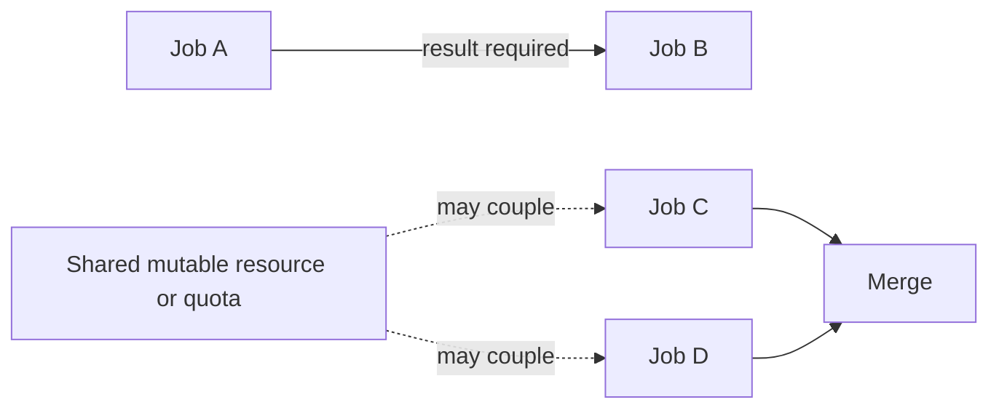
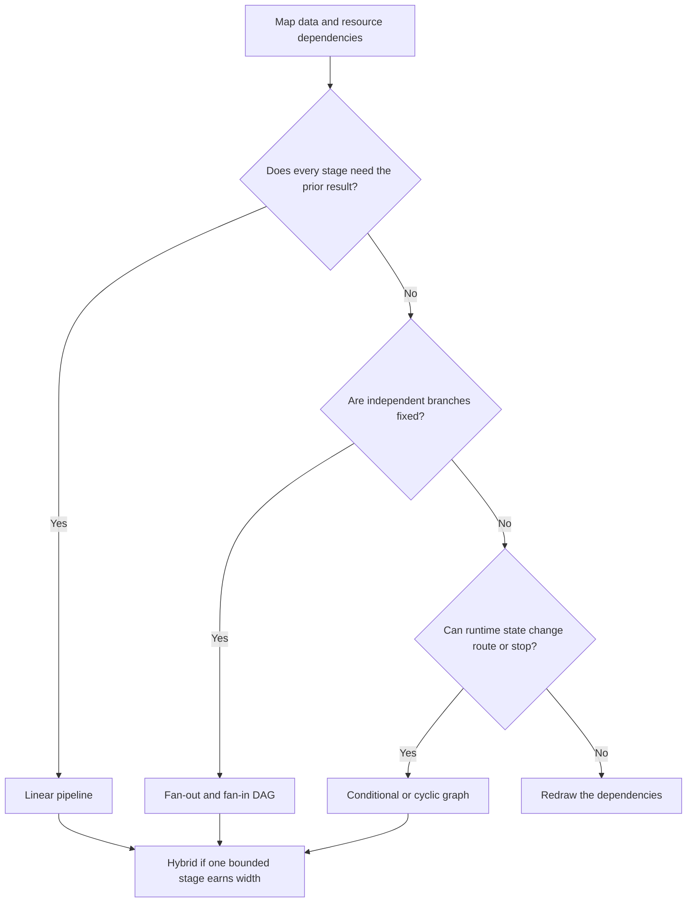
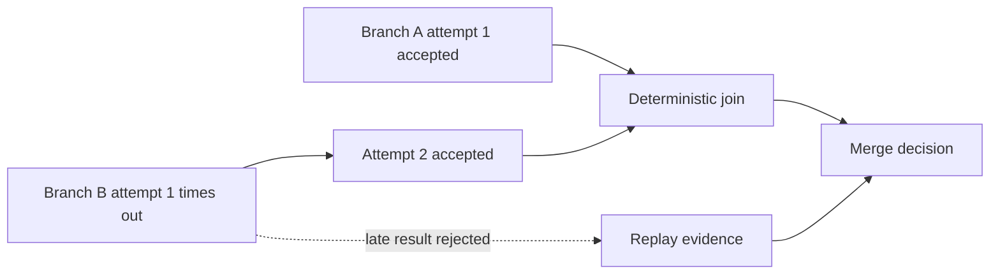
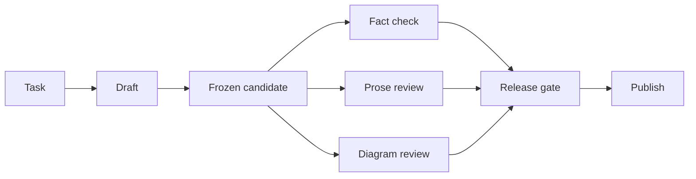

A pipeline is already a graph: one directed path through tasks. [Apache Airflow](https://airflow.apache.org/docs/apache-airflow/stable/core-concepts/dags.html), an open-source workflow orchestrator, models workflows as tasks and the dependencies governing their order. The useful question is therefore not “pipeline or graph?” but how much topology the work needs.

I think the right answer is the smallest shape that represents real dependencies without creating extra coordination. Start with one path, measure it, and add width or return routes only when the work earns them. If independent calls are already required and serial execution breaks the latency target, forcing a straight line would be equally dishonest.

In short

Choose the smallest arrangement of tasks and dependencies that accurately represents the work.

## Draw the dependencies twice

First draw data dependencies: B must wait when it consumes A’s result or authorization. Then draw resource dependencies. Two jobs can exchange no output and still collide through a mutable resource, meaning a shared file, database row, workspace, approval gate, or quota that one can change or exhaust.

[PostgreSQL](https://www.postgresql.org/docs/current/transaction-iso.html), an open-source relational database, documents the mechanism: a concurrent writer may wait when another transaction has changed or locked the same row. A common read-only snapshot does not create that write conflict, while shared writes and limits can impose real ordering.

Apply the fake-edge test to every A → B connection. If B does not consume A’s output, and both can run without racing on mutable state or breaching a shared limit, the edge may be artificial. I think independence has to survive both drawings, not merely two different prompts.

In short

Remove an edge only after checking both data flow and shared resources.

## Let the route reveal the topology

A linear pipeline fits a known route where each stage needs the previous result or permission: ingest request → validate schema → apply policy → persist result. Keep validation, counting, deduplication, and fixed routing in deterministic code; use models where judgment is required.

A DAG, or directed acyclic graph, allows branches but no route back to an earlier task. Fan-out starts independent jobs; fan-in merges them. Researching five market angles can fit this shape when each branch has isolated writes and a declared merge. Separate model contexts may diversify review, but they do not guarantee independent evidence or truth.

A conditional graph selects its next edge from current state; a cyclic graph can revisit earlier work. [LangGraph](https://docs.langchain.com/oss/python/langgraph/graph-api), a framework for stateful agent workflows, documents state-based edges and looping limits. I think a cycle belongs only where a state change can alter the route, with both a meaningful stop condition and a hard step or cost cap. If just one stage branches, use a hybrid with linear control flow around it.

In short

Use a pipeline for sequence, a DAG for fixed breadth, a conditional or cyclic graph for state-dependent routing, and a hybrid when those needs are local.

## Design the failure before the fan-out

Parallel branches can shorten the critical path, the longest required chain of work, but a full join still waits for its slowest required branch. [AWS Step Functions](https://docs.aws.amazon.com/step-functions/latest/dg/state-parallel.html), a managed workflow service, explicitly waits for every Parallel-state branch to terminate. That is documented behavior for one runtime, not a universal speed-up claim.

I think the merge is the real architecture decision. It needs expected branch identities, schemas, deadlines, and provenance, meaning a record of which branch produced each result. It also needs rules for missing, failed, cancelled, duplicate, and late results. Retried side effects require idempotency: repeating one logical request must not repeat the effect. [Stripe’s payment API documentation](https://docs.stripe.com/api/idempotent_requests) shows one concrete idempotency-key design.

Test width against the serial baseline for a fixed window. Predeclare the engineering budget, acceptance owner, latency and quality targets, cost per accepted result, replay test, and stop threshold. Isolation, rate limits, traces, failed attempts, human review, and multiplied model calls belong in that cost.

In short

A branch earns its place only when its governed merge beats a measured serial baseline.

## Meanwhile in sci-fi

Meanwhile in sci-fi

The Expanse (2015)

In this science-fiction television series, which began in 2015, a launch sequence stays ordered because each stage enables the next, while a fleet engagement needs independent units, branching decisions, and convergence. The mapping is direct: turning the launch sequence into a fleet graph adds mission-control failure points without creating independent work.

## Keep the graph-shaped part local

Consider this site’s Content Engine, the task-to-publication system around this article. The diagram is a candidate architecture sketch, not its exact implementation. Task intake, drafting, a release decision, and publication stay ordered. Independent checks could fan out from one frozen draft and converge at a gate, provided they do not edit the same workspace and the gate handles missing results.

I think this bounded hybrid is a strong production default because complexity stays where breadth creates a measurable benefit. Ask four questions:

1. What must wait because it consumes an earlier result?
2. What can run independently without touching the same mutable resource?
3. Can runtime state change the next route or stopping condition?
4. Can the system detect, explain, and replay a partial failure?

If state creates a feedback loop, [“Everyone Discovered Loops. Nobody Agrees What the Word Means.”](/posts/everyone-discovered-loops/) covers loop terminology, ownership, and exit conditions. After topology comes evaluation, typed state, and execution controls, the subject of “The 105 minutes after the graph.” Earn every branch, merge, condition, and return from the work itself.

In short

Keep production flow linear where possible and localize graph behavior to proven independent or state-dependent work.

