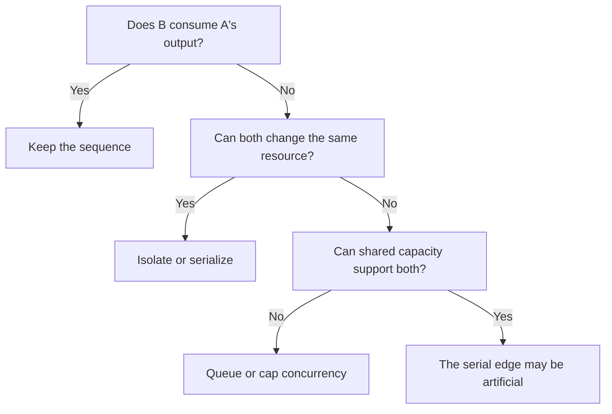
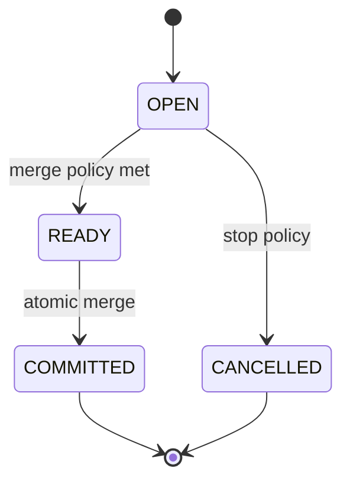
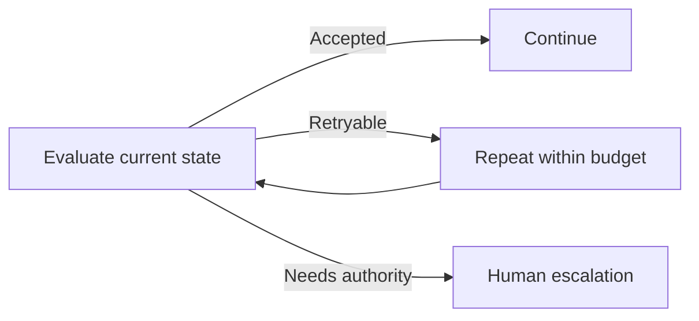
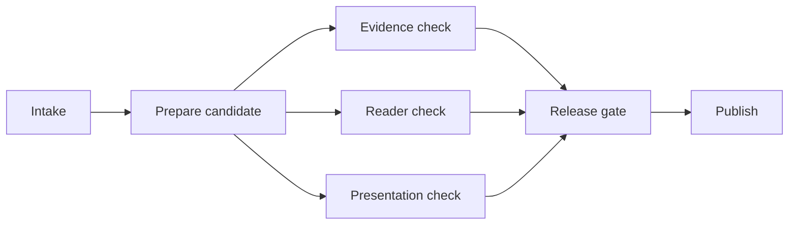

Calling a workflow a graph can make it sound more advanced than calling it a pipeline. The hierarchy is false. [Apache Airflow](https://airflow.apache.org/docs/apache-airflow/stable/core-concepts/dags.html), an open-source workflow orchestrator, models workflows as tasks and execution dependencies. A pipeline is one ordered path through those tasks, so it is already the simplest graph topology. A directed acyclic graph, or DAG, can branch and merge but cannot return to an earlier task; a cyclic graph can.

I think the production question is: what is the least topology that accurately represents who must wait, what may run together, and how failure is recovered? Add width only for real independence. Add a condition or cycle only when current state can change the next action.

In short

Topology should reveal dependencies and recovery paths, not advertise sophistication.

## Find the edges the prompts do not show

Map what each task consumes and changes. A data dependency exists when B needs A's result. A resource dependency exists when concurrent work would be unsafe because both tasks can change the same mutable resource, such as a file, row, workspace, or approval. [PostgreSQL](https://www.postgresql.org/docs/current/transaction-iso.html), an open-source relational database, demonstrates the mechanism: one row update may wait for another transaction to finish.

Capacity coupling is different. [Stripe](https://docs.stripe.com/rate-limits), a payments platform, documents request-rate and simultaneous-request limits separately. A quota may require queues or lower concurrency without deciding the correct task order. I think the fake-edge test is therefore strict: if B does not consume A's result, both use isolated or immutable state, and shared capacity supports them, their serial edge may be artificial.

In short

Check data, mutable state, and capacity before removing a serial edge.

## Design the merge before the branches

Fan-out/fan-in starts independent branches and later merges their results. Removing a false serial edge creates a new DAG and may reduce elapsed time. It is more precise than saying parallel execution shortened the old critical path: the new topology has a different longest required dependency chain, while an all-required merge still waits for its slowest branch and adds overhead. [AWS Step Functions](https://docs.aws.amazon.com/step-functions/latest/dg/state-parallel.html), Amazon's managed workflow service, specifies that its Parallel state waits until every branch terminates.

I think a branch is ready for production only when its merge policy exists first. Define expected branch identities, required and optional results, terminal outcomes, a deadline, and whether failure means retry, cancellation, quorum, or escalation. Commit once, then reject an illegal transition such as `COMMITTED → ACCEPT_LATE`. A retried side effect also needs idempotency, meaning the same logical request can repeat without duplicating its effect; [Stripe's API contract](https://docs.stripe.com/api/idempotent_requests) is one implementation. Replay tests should cover duplicate, missing, late, cancelled, and out-of-order results.

In short

A DAG earns its width only when incomplete and repeated work can be governed at the merge.

## Reserve return paths for changing state

A conditional graph chooses its next edge from current state. A cyclic graph can revisit earlier work. [LangGraph](https://docs.langchain.com/oss/python/langgraph/graph-api), an open-source framework for stateful agent workflows, documents both mechanics, but neither promises better judgment.

I think a return edge is justified when a state change alters the next action: a retryable error, evidence below an acceptance threshold, or a case needing human authority. Work with a route and pass count fixed in advance can remain acyclic. A cycle needs a meaningful stop condition and a hard time, step, or cost limit.

In short

Use a condition or cycle when observed state changes the route, and bound every return.

## Meanwhile in sci-fi

Meanwhile in sci-fi

Battlestar Galactica (2004)

The 2004 science-fiction television series offers a useful contrast between an ordered launch sequence and a fleet engagement with independent units and changing decisions. The mapping is direct: a pipeline fits work in which every stage enables the next, while a branched or conditional graph fits units that can act separately and later converge. Giving the launch sequence a fleet topology adds control paths without creating independence.

## Promote a bounded hybrid with evidence

I think a hybrid is often the strongest production shape when only one part of the work is genuinely wide. The Content Engine, the workflow that produces and checks articles for this site, gives a deliberately high-level example: a linear editorial backbone can open a bounded review burst over an immutable candidate, then converge before a release gate. The diagram explains the topology, not the engine's exact internal stages.

Promote that burst only against a recorded linear baseline. During a fixed test window, compare median and 95th-percentile end-to-end latency, whole-run cost per accepted result, acceptance outcomes, partial failures, and successful replay. Name who approves and operates the change, along with its budget, success threshold, stop threshold, and rollback decision. This is a decision protocol, not production proof.

The architecture review comes down to four questions:

1. What must wait because it consumes an earlier result?
2. What can run independently without changing the same resource?
3. Can runtime state alter the next route or stopping condition?
4. Can the system detect, explain, and replay a partial failure?

[“Everyone Discovered Loops. Nobody Agrees What the Word Means.”](/posts/everyone-discovered-loops/) goes deeper on loop language and exit conditions. Once topology is chosen, “The 105 minutes after the graph” addresses evaluation, typed state, and the trust layer around execution. I think every added edge should survive both reviews.

In short

Keep a linear spine, localize justified complexity, and require measured gains plus an owned rollback.

